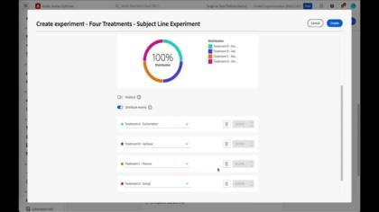

# Tutoriales de Journey Optimizer

Journey Optimizer permite a las empresas crear experiencias del cliente coherentes, contextuales y personalizadas. Guía a los clientes sin problemas a través de todo su recorrido con la marca, desde el punto de contacto inicial hasta el momento en que abandonan el sitio, lo que garantiza una experiencia conectada y satisfactoria en cada punto de contacto.

Esta guía del usuario contiene vídeos y tutoriales sobre las numerosas funciones y características de Adobe Journey Optimizer. Practique lo que ha aprendido enfrentándose a los [retos de Journey Optimizer](https://experienceleague.adobe.com/es/docs/journey-optimizer-learn/challenges/introduction-and-prerequisites).

## Últimos eventos en directo de Experience League

<!-- CARDS
* https://experienceleague.adobe.com/es/docs/events/experience-league-live-recordings/episodes/exl-live-episode-06-18-25
  {title = Master Frequency Capping & Conflict Prioritization (June 18, 2025)}
  {description = In this session, Adobe experts Ariel Sultan and Aaron Forrest dove into new features in Adobe Journey Optimizer to help you govern and prioritize customer messages with precision. They showed how to reduce messaging fatigue, resolve conflicts, and deliver impactful experiences that resonate. }
* https://experienceleague.adobe.com/es/docs/events/experience-league-live-recordings/episodes/exl-live-episode-40-2024-10-24
     {title = Agile Workflows for Personalized Content at Scale (June 05, 2025)}
     {description = In this session, Adobe experts Chris Ivory, Amarnath Vannarath, and Rohan Bhatt showcase how Adobe Journey Optimizer (AJO) seamlessly integrates with Adobe Express and GenStudio for Performance Marketing. Learn how these tools bring unparalleled flexibility, collaboration, and AI-powered creativity to your marketing workflows.}
* https://experienceleague.adobe.com/es/docs/events/experience-league-live-recordings/episodes/exl-live-episode-02-27-25
     {title = Unlocking operational insights with AI Assistant in Adobe Experience Platform (February 27, 2025)}
     {description = ur experts discussed how AI Assistant can unlock valuable operational insights, boosting productivity and redefining work in Adobe Experience Platform and its platform-based applications.}

-->
<!-- START CARDS HTML - DO NOT MODIFY BY HAND -->

    

        

            

                <figure class="image x-is-16by9">
                    
                </figure>
            

            

                

                    

                        <a href="https://experienceleague.adobe.com/es/docs/events/experience-league-live-recordings/episodes/exl-live-episode-06-18-25" target="_blank" rel="referrer" title="Límite de frecuencia principal y priorización de conflictos (18 de junio de 2025)">Límite de frecuencia principal y priorización de conflictos (18 de junio de 2025)</a>
                    

                    
En esta sesión, los expertos de Adobe Ariel Sultan y Aaron Forrest se sumaron a las nuevas funciones de Adobe Journey Optimizer para ayudarle a gobernar y priorizar los mensajes de los clientes con precisión. Mostraron cómo reducir la fatiga de la mensajería, resolver conflictos y ofrecer experiencias impactantes que resuenan.

                

                <a href="https://experienceleague.adobe.com/es/docs/events/experience-league-live-recordings/episodes/exl-live-episode-06-18-25" target="_blank" rel="referrer" class="spectrum-Button spectrum-Button--outline spectrum-Button--primary spectrum-Button--sizeM" style="align-self: flex-start; margin-top: 1rem;">
                    Ver
                </a>
            

        

    

    

        

            

                <figure class="image x-is-16by9">
                    
                </figure>
            

            

                

                    

                        <a href="https://experienceleague.adobe.com/es/docs/events/experience-league-live-recordings/episodes/exl-live-episode-40-2024-10-24" target="_blank" rel="referrer" title="Flujos de trabajo de Agile para contenido personalizado a escala (5 de junio de 2025)">Flujos de trabajo ágiles para contenido personalizado a escala (5 de junio de 2025)</a>
                    

                    
En esta sesión, los expertos de Adobe Chris Ivory, Amarnath Vannarath y Rohan Bhatt muestran cómo Adobe Journey Optimizer (AJO) se integra a la perfección con Adobe Express y GenStudio for Performance Marketing. Descubra cómo estas herramientas aportan una flexibilidad, una colaboración y una creatividad con tecnología de IA sin igual a sus flujos de trabajo de marketing.

                

                <a href="https://experienceleague.adobe.com/es/docs/events/experience-league-live-recordings/episodes/exl-live-episode-40-2024-10-24" target="_blank" rel="referrer" class="spectrum-Button spectrum-Button--outline spectrum-Button--primary spectrum-Button--sizeM" style="align-self: flex-start; margin-top: 1rem;">
                    Ver
                </a>
            

        

    

    

        

            

                <figure class="image x-is-16by9">
                    
                </figure>
            

            

                

                    

                        <a href="https://experienceleague.adobe.com/es/docs/events/experience-league-live-recordings/episodes/exl-live-episode-02-27-25" target="_blank" rel="referrer" title="Desbloquear perspectivas operativas con el asistente de IA en Adobe Experience Platform (27 de febrero de 2025)">Desbloquear perspectivas operativas con el Asistente de IA en Adobe Experience Platform (27 de febrero de 2025)</a>
                    

                    
Nuestros expertos analizaron cómo el asistente de IA puede desbloquear perspectivas operativas valiosas, impulsar la productividad y redefinir el trabajo en Adobe Experience Platform y sus aplicaciones basadas en plataformas.

                

                <a href="https://experienceleague.adobe.com/es/docs/events/experience-league-live-recordings/episodes/exl-live-episode-02-27-25" target="_blank" rel="referrer" class="spectrum-Button spectrum-Button--outline spectrum-Button--primary spectrum-Button--sizeM" style="align-self: flex-start; margin-top: 1rem;">
                    Ver
                </a>
            

        

    

<!-- END CARDS HTML - DO NOT MODIFY BY HAND -->

## Selección de personal

<table>
<tr>
    <td>
    
    

      <a href="../content-management/create-content-using-ai-assistant-for-content-generation.md">
    <strong>Creación de contenido con el Asistente de IA para la Generación de contenido</strong>
    </a>
    

    

    <em>Descubra cómo utilizar el Asistente de IA para la Generación de contenido para generar sugerencias proactivas de variación de contenido, tanto para texto como para imágenes.
</em>
    

  </td>
    <td>
    
    

      <a href="../experimentation/content-experiments-for-emails.md">
    <strong>Configuración de experimentos de contenido para campañas de correo electrónico </strong>
    </a>
    

    

    <em>Aprenda a configurar experimentos de contenido para realizar pruebas A/B y explorar el contenido de correo electrónico que mejor impulse sus objetivos empresariales.</em>
    

  </td>
  </td>
    <td>
    
    

      <a href="../decision-management/create-decisions.md">
    <strong>Introducción a las capacidades de gestión de decisiones </strong>
    </a>
    

    

    <em>El vídeo abarca los retos comerciales que resuelven las capacidades de gestión de decisiones, sus funciones clave, la arquitectura básica y sus principales casos de uso.

</em>
    

  </td>
</tr>
<tr>
  <td>
    
    

      <a href="../create-journeys/use-case-transactional-journey.md">
    <strong>Caso de uso: Recorrido transaccional </strong>
    </a>
    

    

    <em>Comprenda los casos de uso aplicables para los recorridos transaccionales. Obtenga información sobre cómo crear recorridos transaccionales y qué prácticas recomendadas aplicar.</em>
    

  </td>
    <td>
    
    

      <a href="../personalize-content/use-contextual-event-information-for-personalization.md">
    <strong>Uso de información de evento contextual para la personalización </strong>
    </a>
    

    

    <em>Aprenda a utilizar la información de evento contextual de un recorrido para personalizar un mensaje.</em>
    

  </td>
  </td>
    <td>
    
    

      <a href="../report-and-monitor/live-and-global-reports.md">
    <strong>Informes en vivo y globales </strong>
    </a>
    

    

    <em>Conozca la diferencia entre los informes en vivo y globales, cómo acceder y analizar el Recorrido y los informes específicos del Mensaje, y cómo modificar los paneles de informes.

</em>
    

  </td>
</tr>
</table>

