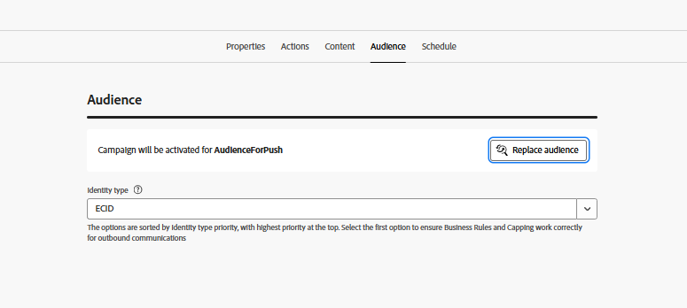

# Crear campaña

En este paso, creará una campaña en Adobe Journey Optimizer para enviar notificaciones push web programadas a los usuarios que se han suscrito. La campaña se dirige a un público apto y envía mensajes en un momento predefinido, lo que permite una participación planificada y basada en el público.

* Iniciar sesión en Journey Optimizer
* Vaya a Administración de Recorrido | Campañas | Crear campañas

## Especificar la configuración de campaña

Especifique el nombre de la campaña

## Asociar acción con la campaña

Asocie la configuración del canal push creada anteriormente en este tutorial.

## Asociar audiencia con la campaña

Asociar la audiencia `AudienceForPush` con la campaña

## Creación de contenido para la notificación push

Cree contenido push básico para probar la notificación push. Especifique el título y el cuerpo del mensaje como se muestra a continuación

## Programación de la campaña

Programe la campaña según sus necesidades

Finalmente, asegúrese de activar la campaña.

## Prueba de la campaña

Para probar la campaña, primero habilite las notificaciones en la página web [activando](http://localhost:3000) cuando se le solicite. Una vez que se haya suscrito, espere a que la campaña se ejecute a su hora programada. Cuando se ejecute la campaña, debería recibir la notificación push en el explorador.
