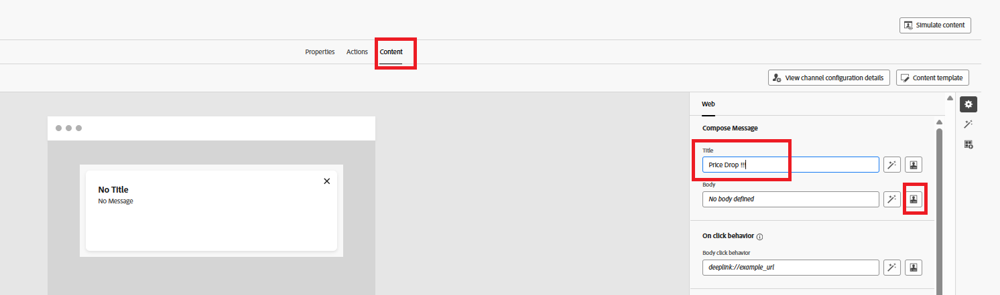
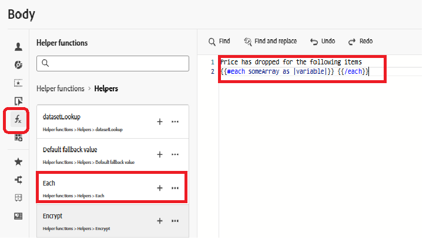

# Crear Recorrido

En este paso, creará un recorrido en Adobe Journey Optimizer activado por el evento personalizado price.drop. Cuando se recibe este evento, el recorrido se inicia en tiempo real y envía una notificación push a los usuarios que se han suscrito, lo que permite la participación basada en eventos.

Para crear un recorrido activado en el evento price.drop, siga los siguientes pasos

* Iniciar sesión en Journey Optimizer
* Vaya a Administración de Recorridos | Recorrido | Crear Recorrido

## Añadir PriceDropEvent

Arrastre `PriceDropEvent` desde la sección de eventos al lienzo

## Añadir acción push

Expanda la sección Acciones. Arrastre y suelte la actividad `Action` en el lienzo y seleccione Insertar como tipo de acción

## Configuración de la acción push

Seleccione la actividad de notificación push y haga clic en configurar acción

## Configuración de canal de notificaciones push

Asociar la configuración `MyFirstWebPushChannel` creada anteriormente en el tutorial con esta notificación push

## Redactar mensaje de notificación push

Añada una combinación de contenido estático y dinámico a la notificación push mediante el editor de personalización para que el mensaje sea más atractivo y relevante.

Para comenzar a redactar el mensaje, haga clic en `Content` para abrir la pestaña de contenido, donde puede definir tanto el texto fijo como los campos dinámicos derivados de los datos de evento.

Especifique el título del mensaje push y, a continuación, abra el editor de personalización para componer el cuerpo del mensaje. El contenido incluirá dinámicamente los nombres de los productos cuyos precios han bajado. Para lograr esto, use la [función de ayuda](https://experienceleague.adobe.com/es/docs/journey-optimizer/using/content-management/personalization/functions/helpers#each) de each
para iterar en la lista de productos y procesar sus nombres dentro del mensaje.

## Componga el cuerpo del mensaje

Seleccione e inserte la función `Each` desde el menú de funciones de ayuda.

Seleccione los atributos contextuales | Journey Orchestration | Eventos | PriceDropEvent | productListItems | Nombre

Haga clic en el icono &quot;+&quot; para insertar la matriz en el bucle each dentro del editor de personalización. A continuación, actualice el contenido del mensaje para que coincida con el formato mostrado en la captura de pantalla de referencia. Tenga en cuenta que el ID de evento mostrado en su entorno puede diferir del que se muestra.

Finalmente, guarde todos los cambios y publique el recorrido. Una vez publicado, el recorrido se activa y escucha los eventos entrantes price.drop. Cada vez que se recibe un evento de este tipo, el recorrido se activa en tiempo real y se envía una notificación push a los usuarios que se han suscrito para recibir notificaciones, lo que garantiza una participación oportuna y relevante.

## Prueba de la solución

Para almacenar en déclencheur el evento price.drop, abra la página de déclencheur [price drop,](http://localhost:3000/price-drop-trigger.html) seleccione uno o más productos y haga clic en Déclencheur Price Drop. Esto envía el evento a través de la capa de datos de Adobe mediante etiquetas de AEP, que a continuación inicia la recorrido y envía la notificación push en tiempo real.

