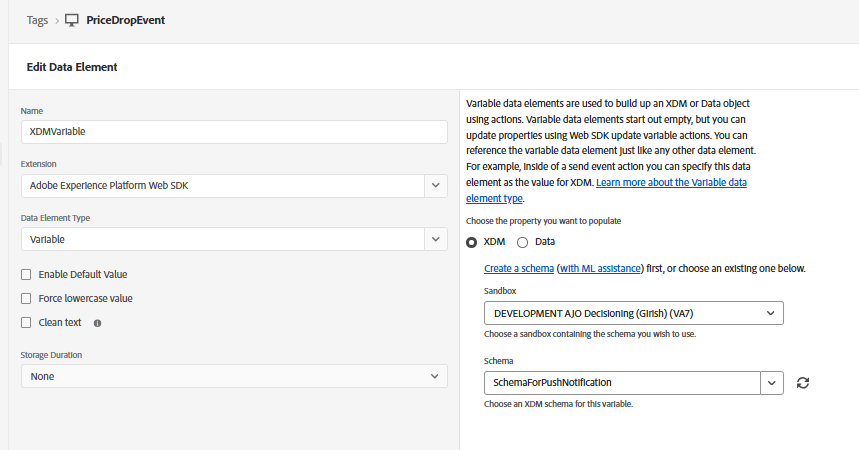
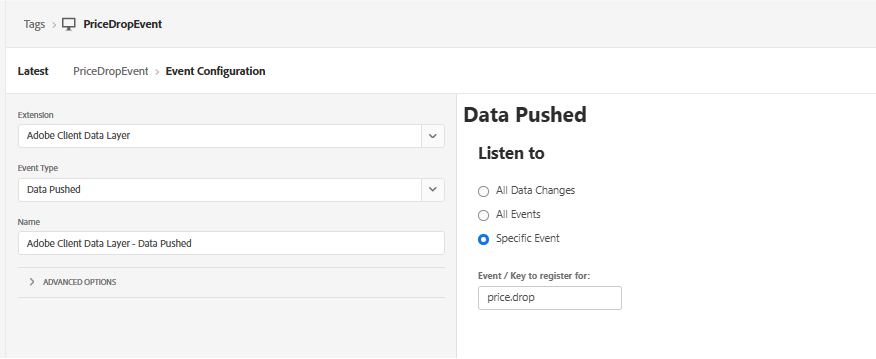

# Crear propiedad de etiqueta

En la segunda parte de este tutorial, aprenderá a almacenar en déclencheur las notificaciones push en tiempo real enviando manualmente un evento personalizado price.drop. Este método utiliza la recopilación de datos de AEP (etiquetas) para capturar el evento desde la página web y enviarlo a Adobe Experience Platform. Una vez introducido el evento, almacena en déclencheur un recorrido en Adobe Journey Optimizer, lo que le permite enviar notificaciones push bajo demanda en función de las acciones del usuario o los eventos empresariales.

Esta propiedad se configura con AEP Web SDK, que está conectado al `WebPushDataStream` creado anteriormente en el tutorial. La propiedad tag escucha el evento `price.drop` en la capa de datos de Adobe y asigna los detalles de producto relevantes actualizando el elemento de datos ProductListItems. Una vez preparados los datos, se activa una regla en la propiedad tag y se envía el evento price.drop a AEP a través de Web SDK. A continuación, este evento sirve como punto de entrada para un recorrido en Adobe Journey Optimizer, lo que permite enviar notificaciones push inmediatamente en función de la caída de precios.

## Elementos de etiqueta

ProductListItems para contener detalles del producto


asignación de la variable xdm a `schemaForPushNotification`



## Crear regla

Escucha el evento price.drop


Actualizar productListItems mediante la variable de actualización

Finalmente, envíe el evento price.drop a AEP con la variable xml actualizada


El siguiente código JavaScript envía el evento price.drop a las etiquetas de AEP desde la página web

```javascript
 <script>
      window.adobeDataLayer.push({
        event: "price.drop",
        productListItems: productListItems
      });
  </script>
```


