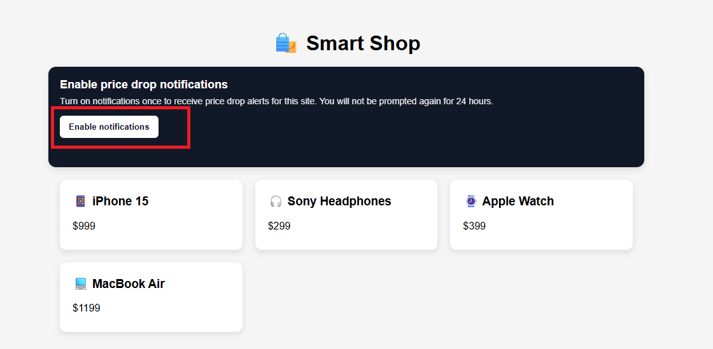

# Inserción web en Adobe Journey Optimizer

Las notificaciones push web son una forma eficaz de volver a atraer a los usuarios en tiempo real y este tutorial le guiará a través de la implementación mediante Adobe Journey Optimizer (AJO). Empiece por utilizar Web SDK para recopilar las preferencias de inclusión de los usuarios para las notificaciones push, lo que garantiza una experiencia de suscripción perfecta y compatible. A continuación, creará una campaña para enviar notificaciones push a los usuarios que se hayan suscrito, lo que permite una participación basada en la audiencia. Por último, aprenderá a aprovechar las etiquetas de AEP para almacenar en déclencheur un evento personalizado de caída de precios, que inicia un recorrido en AJO y ofrece notificaciones push personalizadas y oportunas en función del comportamiento del usuario en tiempo real.

Página web de muestra para permitir que los usuarios acepten notificaciones

Página web de muestra para el evento de caída de precios de déclencheur

## Requisitos previos

Este tutorial está diseñado para ser práctico y fácil de seguir. Aunque no se requiere experiencia profunda, será útil estar familiarizado con los siguientes conceptos:

- Adobe Journey Optimizer (creación de recorridos o campañas)
- Recopilación de datos de AEP (etiquetas) y Web SDK
- Conceptos básicos de Adobe Experience Platform como esquemas y eventos
- Algunos conceptos generales de desarrollo web y JavaScript
- Conocimientos básicos de Node.js (para generar claves VAPID y servir un punto final de configuración simple)

Si es nuevo en cualquiera de estas áreas, no se preocupe: el tutorial le guiará a través de los pasos clave a lo largo del camino.
Este tutorial se centra en la implementación de un caso de uso de notificaciones push web de extremo a extremo, por lo que un conocimiento práctico de las herramientas y conceptos anteriores le ayudará a seguirlas de forma eficaz.

## 🔔 Habilitar notificaciones del explorador

Si las notificaciones están bloqueadas o no aparecen, es posible que tenga que habilitarlas en la configuración del explorador. Consulte las guías a continuación:

- **Google Chrome (Windows/macOS)**\
  <https://support.google.com/chrome/answer/3220216>

- **Microsoft Edge (Windows)**\
  <https://support.microsoft.com/en-us/microsoft-edge/manage-website-notifications-in-microsoft-edge>

- **Safari (macOS)**\
  <https://support.apple.com/guide/safari/customize-website-notifications-sfri40734/mac>

- **Safari (iPhone/iPad)**\
  <https://support.apple.com/en-us/HT213893>

## Aplicación de ejemplo

Para ayudarle a seguir, hay disponible una aplicación de ejemplo completa.

- [Demostración en directo - Inclusión:](https://ajo-web-push.onrender.com/)

- [Evento de bajada de precios de Déclencheur:](https://ajo-web-push.onrender.com/price-drop-trigger.html)

- [Código Source:](https://github.com/gbedekar489/ajo-web-push)

Puede explorar la demostración en directo para ver el flujo en acción o clonar el repositorio para ejecutar el proyecto localmente.

