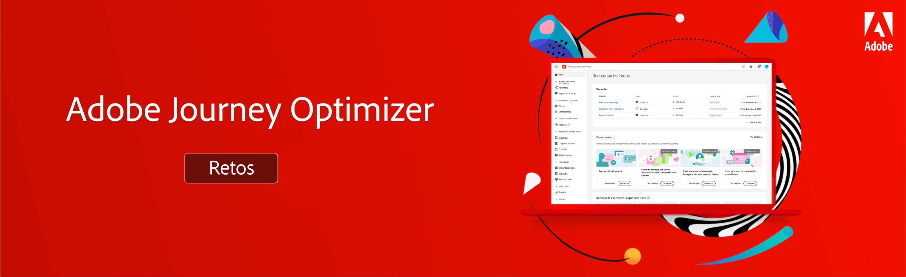

# Desafíos de Journey Optimizer: introducción y requisitos previos

Los desafíos proporcionan un escenario y los requisitos necesarios para practicar lo que ha aprendido. Los desafíos le ayudan a evaluar su nivel de habilidades e identificar lagunas de conocimiento.

Cada desafío de esta sección aborda un caso de uso único que usted implementa. La audiencia (persona) de destino y las habilidades requeridas se enumeran al principio de cada desafío.

## Requisitos previos

### Requisitos del sistema

* Acceso a un simulador para pruebas de Journey Optimizer : recomendamos completar el desafío en un simulador para pruebas de formación dedicado.
* AEM Assets Essentials debe estar aprovisionado para su instancia
* El canal de correo electrónico debe configurarse para los mensajes transaccionales y de marketing

### Derechos de acceso

Necesita los siguientes derechos de acceso:
* *Administrador de recorridos* o *Administrador de recorridos*
* Ver perfiles de prueba y sus atributos

>[!NOTE]
> Los ejercicios se desarrollaron sobre la base de los datos de la muestra de Luma. Se recomienda configurar un simulador para pruebas de formación configurado con los datos de ejemplo. Visite el tutorial [Configuración de un simulador para pruebas de formación](/help/tutorial-configure-a-training-sandbox/introduction-and-prerequisites.md) para obtener instrucciones detalladas.

### Acciones necesarias

* Si es nuevo en Adobe Journey Optimizer, complete el curso [Introducción a Journey Optimizer para administradores y gestores de Recorrido](https://experienceleague.adobe.com/?recommended=JourneyOptimizer-U-1-2021.1&amp;lang=es).

## La historia

Luma es una empresa ficticia de ropa deportiva, con tiendas en varios países, presencia en línea con un sitio web y aplicaciones móviles. Luma utiliza Adobe Journey Optimizer para ofrecer experiencias conectadas, contextuales y personalizadas a sus clientes.

Luma busca promocionar su última colección de ropa y engranajes y dirigir las ventas a los clientes existentes. Se le ha contratado para implementar las campañas de marketing y retención de Luma en Journey Optimizer.

## Sus desafíos

<table>
<tr>
<td>
 

      
      

  </td>
  <td>
   <strong><a href="summer-collection-announcement-challenge.md">Crear un anuncio de colección de verano </strong>
    </a>
      

      <em>Cree un recorrido que envíe un correo electrónico de anuncio de colección de verano a un segmento de clientes existentes. </em>
      

      <b>Competencias requeridas:</b>
      <li><a href="https://experienceleague.adobe.com/docs/journey-optimizer-learn/tutorials/profiles-segments-subscriptions/create-segments.html"> Creación de segmentos</li>
      <li><a href="https://experienceleague.adobe.com/docs/journey-optimizer-learn/tutorials/create-journeys/use-case-read-segment.html">Lectura de segmento</li>
       <li><a href="https://experienceleague.adobe.com/docs/journey-optimizer-learn/tutorials/create-messages/create-emails/import-and-author-html-email-content.html">Importar contenido de correo electrónico del HTML</li>
  </td>
  </tr>
   <tr>
    <td>
    

    
    

    <td>
    

      <a>
    <strong><a href="loyalty-status-welcome-email-challenge.md">Crear un correo electrónico de bienvenida de estado de fidelidad </strong>
    </a>
    

    

    <em>Envíe un correo electrónico cuando un cliente fiel se desplace a un nuevo nivel para felicitarlo e informarle de sus nuevas ventajas.</em>
    

    <b>Competencias requeridas:</b>
      <li><a href="https://experienceleague.adobe.com/docs/journey-optimizer-learn/tutorials/profiles-segments-subscriptions/create-segments.html"> Creación de segmentos</li>
      <li><a [href="https://experienceleague.adobe.com/docs/journey-optimizer-learn/tutorials/create-journeys/use-case-read-segment-qualification.html">Clasificación del segmento</li>
      <li><a href="https://experienceleague.adobe.com/docs/journey-optimizer-learn/tutorials/create-messages/create-emails/import-and-author-html-email-content.html">Importación y creación de contenido de correo electrónico HTML</li>
  </td>
  </tr>
  <tr>
  <td>
  

    
  </td>
  <td>
      <a href="order-confirmation-challenge.md">
    <strong><a href="order-confirmation-challenge.md">Crear una confirmación de pedido</strong>
    </a>
    

    

    <em>Pruebe sus conocimientos sobre cómo crear y personalizar mensajes transaccionales
    </em>
    

    <b>Competencias requeridas:</b>
      <li><a href="https://experienceleague.adobe.com/docs/journey-optimizer-learn/tutorials/create-messages/create-content-with-the-email-designer.html"> Creación de contenido de correo electrónico con el editor de mensajes</li>
      <li><a href="https://experienceleague.adobe.com/docs/journey-optimizer-learn/tutorials/personalize-content/use-contextual-event-information-for-personalization.html">Uso de información de evento contextual para la personalización</li>
      <li><a href="https://experienceleague.adobe.com/docs/journey-optimizer-learn/tutorials/personalize-content/use-helper-functions-for-personalization.html?lang=en">Uso de funciones de ayuda para la personalización</li>
  </td>
</table>
