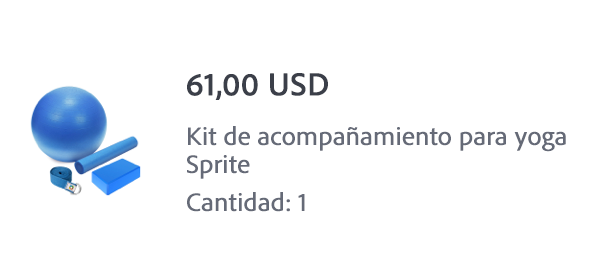

# Crear un correo electrónico de confirmación del pedido


| Desafío | Crear un correo electrónico transaccional de confirmación de pedido |
|---|---|
| Grupo de usuarios | Administrador de recorridos |
| Capacidades necesarias | <ul><li>[Creación de contenido de correo electrónico con el editor de mensajes](https://experienceleague.adobe.com/docs/journey-optimizer-learn/tutorials/email-channel/create-content-with-the-email-designer.html?lang=es)</li> <li>[Uso de información de evento contextual para la personalización](https://experienceleague.adobe.com/docs/journey-optimizer-learn/tutorials/personalize-content/use-contextual-event-information-for-personalization.html? lang=es)</li><li>[Uso de funciones de ayuda para la personalización](https://experienceleague.adobe.com/docs/journey-optimizer-learn/tutorials/personalize-content/use-helper-functions-for-personalization.html?lang=es)</li></ul> |
| Recursos que se van a descargar | [Recursos de confirmación de pedido](/help/challenges/assets/email-assets/order-confirmation-assets.zip) |

{style=&quot;table-layout:auto&quot;}

## La historia

Luma va a lanzar su tienda en línea y quiere garantizar una buena experiencia del cliente. Proporcionan un correo electrónico de confirmación de pedido una vez que un cliente ha realizado un pedido.

## Su reto

Crear un recorrido que envíe un correo electrónico de confirmación de pedido cuando un cliente de Luma complete un pedido en línea.

>[!BEGINTABS]

>[!TAB Tarea]

1. Cree un recorrido llamado `Luma - Order Confirmation`.

1. Utilice el evento: `LumaOnlinePurchase`.

1. Cree un correo electrónico **transaccional**  llamado `Luma - Order Confirmation`.

   * La línea de asunto &quot;Gracias por su compra, `FirstName`&quot;

   * Utilice la plantilla `Luma - Order summary` y modifíquela:

      * Quite las secciones `You may also like`

      * Añada el vínculo de cancelación de suscripción en la parte inferior del correo electrónico

El correo electrónico debe estructurarse de la siguiente manera:
<table>
<tr>
<td>
  <div>
     <strong> Sección de encabezado</strong>
      </div>
  </td>
  <td>
      <p>
     <li>luma_logo.png</li>
    <li>Debe tener un vínculo al sitio web de luma: https://luma.enablementadobe.com/content/luma/us/en.html</li>
    <p>
    </td>
  </tr>
  <tr>
  <td>
  <div>
    <strong>Sección de confirmación de pedido
    </strong>
  </td>
  <td>
    <p>
    <strong>Texto</strong><p>
    <em>Hola {firstName},</em><p>
   <div>
    <p>
     <em>Se ha hecho el pedido.
    <p>Cuando el paquete se envíe, le mandaremos un correo electrónico con un número de seguimiento para que pueda hacer un seguimiento del pedido.</p></em>
    </strong>
    </tr>
  </td>
 <td>
  <div>
     <strong> Enviar a sección</strong>
      </div>
      <p>
      <li>El nombre y los apellidos proceden del perfil
      <li>Reemplace la dirección codificada de forma rígida en la plantilla con la <b>dirección de envío</b>
      <li>Los detalles de la dirección son atributos contextuales del evento (calle 1, ciudad, código postal, estado)
      <li> Quitar el <i>descuento, el total, la llegada</i></p>
  </td>
  <td>
  <p> Enviar a:</p>
      <em>{firstName} {lastName}<br>
     {Street 1}<br>
     {City}, {State} {postalCode}<br></em></p>
  </td>
 <tr>
<td>
  <div>
     <strong>Sección Detalles del pedido</strong>
      </div>
       <p><li>Agregue esta sección debajo de <b>Enviar a</b> para obtener más información.
      </p><br>
      <p><b>Sugerencias:</b>
      <li>Uso del componente de estructura <b>1:2 columna izquierda</b> para esta sección
      <li>Se trata de información contextual del evento.
      <li>Utilice la [!UICONTROL helper function]: [!UICONTROL Each]
      <li>Cambie al formato del editor de código para añadir los datos contextuales.
  </td>
  <td>
    <strong>Encabezado</strong>
    <p>
  Pedido: <em>{purchaseOrderNumber}</em>
    </p>
    <strong>Lista de productos pedidos:
  </strong>
  <p>Enumere cada producto en el orden con una imagen, el precio y el nombre.
  <p>El diseño de cada elemento debería tener este aspecto:
  
<p><b>Agregar el vínculo al carro de compras</b>
<p>Sustituya el ID de pedido de la dirección URL por el número de orden de compra:
 <i>https://luma.enablementadobe.com/content/luma/us/en/user/account/order-history/order-details.html?orderId=90845952-c2ea-4872-8466-5289183e4607</i>
</td>
  </tr>
</table>

>[!TIP]
>
>Para permitirle solucionar problemas sobre sus recorridos, la práctica recomendada es añadir una ruta alternativa a todas las acciones de mensajes en caso de tiempo de espera o error.

>[!TAB Requisitos de éxito]

Active el recorrido que ha creado en el modo de prueba y envíeselo a sí mismo por correo electrónico:

1. Antes de cambiar al modo de prueba, anule los parámetros de correo electrónico para enviar al correo electrónico de prueba a su dirección de correo electrónico:
   1. Abra la vista de detalles del correo electrónico.
   1. En la sección de Parámetros de correo electrónico, haga clic en el símbolo T (habilitar anulación de parámetros)
   1. Haga clic en el campo Dirección
   1. En la siguiente pantalla, añada su dirección de correo electrónico entre paréntesis: *&quot;yourname@yourdomain&quot;* en el editor de expresiones y haga clic en OK.
1. Poner el recorrido en modo de prueba
1. Active el evento con estos parámetros:
   * Establezca el identificador de perfil en: Valor de identidad:`a8f14eab3b483c2b96171b575ecd90b1`
   * Tipo de evento: commerce.purchases
   * `Quantity`: 1
   * `Price Total:` 69
   * `Purchase Order Number:` 90845952-c2ea-4872-8466-5289183e4607
   * `SKU:` LLMH09
   * `City:`San Jose
   * `Postal Code:` 95119
   * `State`: CA
   * `Street:` 245 Park Avenue

Debe recibir el correo electrónico de confirmación de compra personalizado.

* La línea de asunto debe tener el nombre del perfil de prueba: Leora

* Este es el aspecto que debería tener el cuerpo del correo electrónico:


>[!TAB Compruebe su trabajo]

**Recorrido**


**Correo electrónico**

**Línea de asunto:**

¡Gracias por su compra, {{ profile.person.name.firstName }}!

**Enviar a la sección:**

Este es el aspecto que debería tener el código:

```javascript
{{ profile.person.name.firstName }} {{ profile.person.name.lastName }}
{{context.journey.events.454181416.commerce.shipping.address.street1}}
{{context.journey.events.454181416.commerce.shipping.address.city}}, {{context.journey.events.454181416.commerce.shipping.address.state}} {{context.journey.events.454181416.commerce.shipping.address.postalCode}}
```

*event.45481416* es un número diferente para usted.

SUGERENCIA: Personalice cada línea por separado

**Sección de detalles del pedido:**

Este es el aspecto que debería tener el código:

Encabezado:

```javascript
Order #: {{context.journey.events.1627840522.commerce.order.purchaseOrderNumber}}
```

**Lista de productos:**

Utilice la función de ayuda “cada uno” para crear la lista de productos. Visualizarlos en una tabla. Este es el aspecto que debería tener el código (con variables específicas como su ID de evento, en lugar de `454181416` y su ID de organización en lugar de `techmarketingdemos` ):

```javascript
{{#each context.journey.events.454181416.productListItems as |product|}}<tr> <th class="colspan33"><div class="acr-fragment acr-component image-container" data-component-id="image" style="width:100%;text-align:center;" contenteditable="false"><!--[if mso]><table cellpadding="0" cellspacing="0" border="0" width="100%"><tr><td style="text-align: center;" ><![endif]--><!--[if mso]></td></tr></table><![endif]--></div></th> <th class="colspan66"><div class="acr-fragment acr-component" data-component-id="text" contenteditable="false"><div class="text-container" contenteditable="true"><p><span style="font-weight:700;">{{context.journey.events.454181416.productListItems.VYG__902489191a0a40e67f51f17f3ea9e2dfaf2dea3bd0bebe8b._techmarketingdemos.product.name}}</span></p></div></div><div class="acr-fragment acr-component" data-component-id="text" contenteditable="false"><div class="text-container" contenteditable="true"><p>${{context.journey.events.454181416.productListItems.VYG__902489191a0a40e67f51f17f3ea9e2dfaf2dea3bd0bebe8b._techmarketingdemos.product.price}}.00</p></div></div></th></tr> {{/each}}
```

**Botón Ver orden:**

`https://luma.enablementadobe.com/content/luma/us/en/user/account/order-history/order-details.html?orderId={{context.journey.events.454181416.commerce.order.purchaseOrderNumber}}`

**Precio total:**

Total:`${{context.journey.events.1627840522.commerce.order.priceTotal}}.00`


>[!ENDTABS]