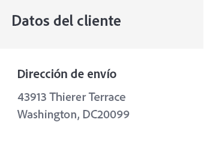

# Crear un correo electrónico de confirmación del pedido


| Desafío | Crear un correo electrónico transaccional de confirmación de pedido |
|---|---|
| Grupo de usuarios | Administrador de recorridos |
| Capacidades necesarias | <ul><li>[Creación de contenido de correo electrónico con el editor de mensajes](https://experienceleague.adobe.com/docs/journey-optimizer-learn/tutorials/create-messages/create-email-content-with-the-message-editor.html? lang=es)</li> <li>[Uso de información de evento contextual para la personalización](https://experienceleague.adobe.com/docs/journey-optimizer-learn/tutorials/personalize-content/use-contextual-event-information-for-personalization.html? lang=es)</li><li>[Uso de funciones de ayuda para la personalización](https://experienceleague.adobe.com/docs/journey-optimizer-learn/tutorials/personalize-content/use-helper-functions-for-personalization.html? lang=es)</li></ul> |
| Recursos que se van a descargar | [Recursos de confirmación de pedido](/help/challenges/assets/email-assets/order-confirmation-assets.zip) |

## La historia

Luma va a lanzar su tienda en línea y quiere garantizar una buena experiencia del cliente proporcionando un correo electrónico de confirmación de pedido cuando el cliente haya hecho uno.


## Su reto

Crear un recorrido que envíe un correo electrónico de confirmación de pedido cuando un cliente de Luma complete un pedido en línea. Sobre Luma

>[!BEGINTABS]

>[!TAB Tarea]

1. Cree un recorrido llamado `Luma - Order Confirmation`
2. Utilice el evento: `LumaOnlinePurchase` como un activador
3. Cree el correo electrónico de confirmación de pedido llamado `Luma - Order Confirmation`:

* Categoría transaccional: asegúrese de seleccionar la superficie de correo electrónico transaccional
* La línea de asunto debe estar personalizada con el nombre de los destinatarios e incluir la frase “gracias por su compra”
* Utilice la plantilla `Luma - Order summary` y modifíquela:

El correo electrónico debe estructurarse de la siguiente manera:
<table>
<tr>
<td>
  <div>
     <strong> Sección de encabezado</strong>
      </div>
  </td>
  <td>
    <strong>Logotipo de Luma</strong>
      <p>
     <li>luma_logo.png</li>
    <li>Debe tener un vínculo al sitio web de luma: https://publish1034.adobedemo.com/content/luma/us/en.html?lang=es</li>
    <p>
    </td>
  </tr>
  <tr>
  <td>
  <div>
    <strong>Sección de confirmación de pedido
    </strong>
  </td>
  <td>
    <p>
    <strong>Texto</strong><p>
    <em>Oye, {nombre}</em><p>
    <li>Alignment: left  </li>
   <li>Text color: rgb(69, 97, 162) #4461a2; 
   <li>font-size: 20px</li>
   <div>
    <p>
     <em>Se ha hecho el pedido.
    <p>Cuando el paquete se envíe, le mandaremos un correo electrónico con un número de seguimiento para que pueda hacer un seguimiento del pedido.</p></em>
    </strong>
    </tr>
  </td>
 <td>
  <div>
     <strong> Enviar a sección</strong>
      </div>
      <p><li>Reemplace la dirección codificada de forma rígida en la plantilla con la dirección de envío 
      <li>Los detalles de la dirección son atributos contextuales del evento (calle, ciudad, código postal, estado)
      <li>El nombre y los apellidos proceden del perfil
      <li> Eliminar el descuento, el total, la llegada</p>
  </td>
  <td>
  <p> Enviar a:</p>
      <em>Nombre y apellidos<br>
     Dirección</em></p>
  </td>
 <tr>
<td>
  <div>
     <strong>Sección Detalles del pedido</strong>
      </div>
       <p><li>Agregue esta sección después de la sección <b>Enviar a</b> y del botón <b>Ver perdido</b>.
      </p><br>
      <p><b>Sugerencias:</b>
      <li>Se trata de información contextual del evento.
      <li>Utilice la [!UICONTROL helper function]: [!UICONTROL Each]
      <li>Cambie al formato del editor de código para añadir los datos contextuales.
      <li>Coloque la información en contenedores con etiquetas DIV.
  </td>
  <td>
    <strong>Encabezado</strong>
    <p>
    <em>Pedido: `purchaseOrderNumber`</em>
    </p>
    <strong>Lista de productos pedidos:
  </strong>
  <p>Cada uno de los elementos debe tener el siguiente formato:
  
</p>
<strong>Imagen del producto:</strong>
<li>class: cart-item-chair
<li>style: border-box: min-height:40px</li>
<li>relleno superior e inferior:20px</li>
<li>padding-left:80px</li>
<li>border-radius:0px</li>
<li>Usar como imagen de fondo para el contenedor</li>
<li>background-position: 0% 50%</li>
<li>background-size: 60px</li>
<li>background-repeat: no-repeat</li>
<p>
<strong>Precio:</strong>
<li>Formato = H5</li>
<li>style = box-sizing:border-box</li>
<li>margin-bottom:5px</li>
<li>margin-top:0px;</li>
<p>
<strong>Nombre y cantidad:</strong>
<li>class=text-small</li>
<li>style=box-sizing: border-box</li>
<li>padding-top: 5px</li>
<li>color: rgb(101, 106, 119)</li>
<li>font-size:14px</li>
<p>
</td>
  </tr>
</table>


>[!TIP]
>
>Para permitirle solucionar problemas sobre sus recorridos, la práctica recomendada es añadir una ruta alternativa a todas las acciones de mensajes en caso de tiempo de espera o error.

>[!TAB Requisitos de éxito]

Active el recorrido que ha creado en el modo de prueba y envíeselo a sí mismo por correo electrónico:

1. Muestre los valores ocultos haciendo clic en el símbolo del ojo:
   1. En Parámetros de correo electrónico, haga clic en el símbolo T (habilitar anulación de parámetros)
      
   2. Haga clic en el campo Dirección
   3. En la siguiente pantalla, añada su dirección de correo electrónico entre paréntesis: *yourname@yourdomain* en el editor de expresiones y haga clic en OK.
2. Poner el recorrido en modo de prueba
3. Active el evento con estos parámetros:
   * Establezca el identificador de perfil en: Valor de identidad:`a8f14eab3b483c2b96171b575ecd90b1`
   * Tipo de evento: commerce.purchases
   * Nombre: Sprite Yoga Companion Kit
   * Cantidad: 1
   * `Price Total:` 61
   * `Purchase Order Number:` 6253728
   * `SKU:` 24-WG080
   * `productImageURL:` <https://publish1034.adobedemo.com/content/dam/luma/en/products/gear/fitness-equipment/luma-yoga-kit-2.jpg>
   * `City:` San Jose
   * `Postal Code:` 95110
   * `State`: CA
   * `Street:` 345 Park Ave

Tiene que recibir el correo electrónico de confirmación de compra personalizado con el producto especificado.

* La línea de asunto debe tener el nombre del perfil de prueba: Leora
* La sección de detalles del pedido tiene que rellenarse con los detalles del pedido introducidos durante la prueba

>[!TAB Compruebe su trabajo]

**Recorrido**


**Correo electrónico**

**Línea de asunto:**

{{ profile.person.name.firstName }}, ¡gracias por su compra!

**Enviar a la sección:**

Este es el aspecto que debería tener el código:

```javascript
{{ profile.person.name.firstName }} {{ profile.person.name.lastName }}
{{context.journey.events.454181416.commerce.shipping.address.street1}}
{{context.journey.events.454181416.commerce.shipping.address.city}}, {{context.journey.events.454181416.commerce.shipping.address.state}} {{context.journey.events.454181416.commerce.shipping.address.postalCode}}
```

*event.45481416* será un número diferente para usted.

SUGERENCIA: Personalice cada línea por separado

**Sección de detalles del pedido:**


Este es el aspecto que debería tener el código:

Encabezado:

```javascript
Order: {{context.journey.events.1627840522.commerce.order.purchaseOrderNumber}}
```

**Lista de productos:**

Utilice la función de ayuda “cada uno” para crear la lista de productos. Visualizarlos en una tabla. Este es el aspecto que debería tener el código:

```javascript
<div class="text-container" contenteditable="true">
  <p><span class="acr-expression-field" contenteditable="false">{{#each context.journey.events.454181416.productListItems as |product|}}
    </span></p>
  <div class="cart-item-chair" style="box-sizing:border-box;min-height:40px;padding-top:20px;padding-bottom:20px;padding-left:80px;border-radius:0px;background-image:url({{product.VYG__902489191a0a40e67f51f17f3ea9e2dfaf2dea3bd0bebe8b._techmarketingdemos.product.imageUrl}});background-position:0% 50%;background-size:60px;background-repeat:no-repeat;">
    <h5 style="box-sizing:border-box;margin-bottom:5px;font-size:16px;line-height:20px;margin-top:0px;">${{product.VYG__902489191a0a40e67f51f17f3ea9e2dfaf2dea3bd0bebe8b._techmarketingdemos.product.price}}.00</h5>
    <div class="text-small" style="box-sizing:border-box;padding-top:5px;color:rgb(101, 106, 119);font-size:14px;">{{product.VYG__902489191a0a40e67f51f17f3ea9e2dfaf2dea3bd0bebe8b._techmarketingdemos.product.name}}</div>
    <div class="text-small" style="box-sizing:border-box;padding-top:5px;color:rgb(101, 106, 119);font-size:14px;">Quantity: {{product.quantity}}</div>
  </div>
  <div class="divider-small" style="box-sizing:border-box;height:1px;margin-top:10px;margin-bottom:10px;background-color:rgb(209, 213, 223);"> </div>
  {{/each}}<p></p>
  <p></p>
</div>
```

**Precio total:**

Total:`${{context.journey.events.1627840522.commerce.order.priceTotal}}`

**Sección de información del cliente**



La personalización debería tener este aspecto:

```javascript
{{profile.homeAddress.street1}}
{{profile.homeAddress.city}},{{profile.homeAddress.state}} {{profile.homeAddress.postalCode}}
```

>[!ENDTABS]