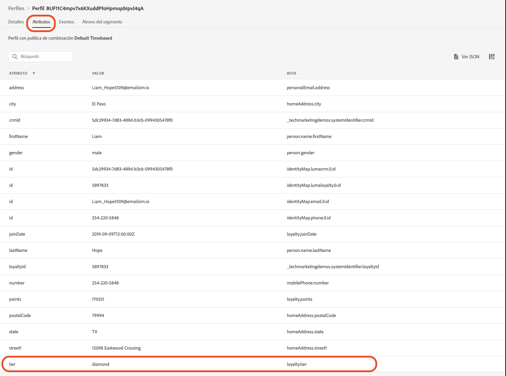
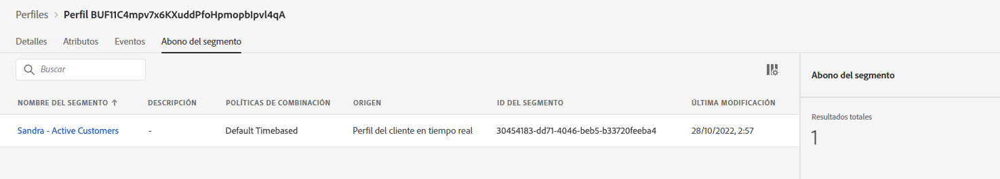

# Crear un anuncio de colección de verano: reto


| Reto | Crear un anuncio de colección de verano |
|---|---|
| Grupo de usuarios | Administrador de recorridos |
| Capacidades necesarias | <ul><li>[Creación de segmentos](https://experienceleague.adobe.com/docs/journey-optimizer-learn/tutorials/profiles-segments-subscriptions/create-segments.html?lang=es)</li><li> [Importación y creación de contenido de correo electrónico HTML](https://experienceleague.adobe.com/docs/journey-optimizer-learn/tutorials/create-messages/create-emails/import-and-author-html-email-content.html?lang=es)</li><li>[Caso de uso: Segmento de lectura](https://experienceleague.adobe.com/docs/journey-optimizer-learn/tutorials/create-journeys/use-case-read-segment.html?lang=es)</li> |
| Recursos que se van a descargar | [Archivos de correo electrónico de recopilación estacional](/help/challenges/assets/email-assets/emails-seasonal-collection-announcement.zip) |

{style="table-layout:auto"}

## La historia

Luma, una compañía de ropa deportiva ficticia, está promocionando su última colección de ropa y equipos e impulsando ventas para clientes existentes. Luma inicia la nueva colección de verano y desea dirigirse específicamente a diferentes segmentos de clientes.

## Su reto

El equipo de marketing de Luma le pedirá que implemente una campaña de marketing de la colección de verano en Journey Optimizer. Su reto es el siguiente:

* Crear un segmento que defina qué perfiles cumplen los requisitos para recibir la promoción.
* Creación del recorrido.

### Paso 1: Definir el segmento, clientes activos

>[!BEGINTABS]

>[!TAB Tarea]

#### Cree un segmento en [!DNL Journey Optimizer]

* Cree un segmento en [!DNL Journey Optimizer] llamado *Clientes activos*.
* El segmento solo debe incluir clientes de Luma activos.
* Los clientes activos se definen como clientes que tienen un nivel en el programa de fidelidad de Luma (bronce, plata, oro o platino).


>[!TAB Criterios de éxito]

En el generador de segmentos, puede ver el número estimado de perfiles cualificados. Si está trabajando con los datos de la zona protegida de formación, tiene unos 753 perfiles cualificados de 1,29 K.

>[!NOTE]
>Puede tardar hasta 24 horas en aparecer la inscripción a segmentos para los perfiles existentes, ya que los perfiles existentes deben rellenarse.

**Se ha añadido un perfil correspondiente al segmento:**

Puede comprobar que los perfiles que se han agregado al segmento cumplen los requisitos navegando a uno de los perfiles enumerados en la vista de detalles del segmento.

 En la página de perfil, marque la pestaña [!UICONTROL Atributos] para confirmar que cumplen los requisitos: el nivel debe ser plata, oro, platino o diamante.



También puede marcar la pestaña [!UICONTROL inscripción a segmentos]: el segmento debe aparecer en la lista.



>[!TAB Compruebe su trabajo]

Campos de segmento: **[!UICONTROL Atributos]** > **[!UICONTROL Perfil individual XDM]** > **[!UICONTROL Fidelidad]** > **[!UICONTROL Nivel]**

Este es el aspecto que debería tener el segmento:


El código debería tener este aspecto:

```javascript
stringCompare("equals", loyalty.tier, ["diamond", "gold", "platinum", "silver"], false)
```

>[!ENDTABS]


### Paso 2: Creación del anuncio recorrido, colección de verano

>[!BEGINTABS]

>[!TAB Tarea]

#### Enviar el anuncio de la colección de verano

Una agencia le proporcionó cuatro archivos HTML con el diseño de los correos electrónicos:

* `SeasonalCollectionEmail.html`
* Correo electrónico de recopilación de Luma Men
* Correo electrónico de la colección para mujer de Luma
* Luma: correo electrónico del 20 % de descuento en la colección

1. [Descargar los archivos del correo electrónico de la colección estacional](/help/challenges/assets/email-assets/emails-seasonal-collection-announcement.zip).

1. Cree un recorrido llamado *Luma: Anuncio de la colección de verano* en función de las siguientes directrices:

   1. Envíe el correo electrónico *Luma: Nuevo anuncio de la colección de verano* al segmento de los *Clientes activos*, y mantenga el 10 % de la audiencia como grupo de control.
      * Título del mensaje *Luma - Anuncio de la colección de verano*
      * Línea de asunto *(nombre del destinatario), la nueva colección de verano de Luma está aquí.*
      * Utilice el archivo de HTML proporcionado `SeasonalCollectionEmail.html` para el cuerpo del correo electrónico.
   1. Espere dos días y envíe un correo electrónico de seguimiento con contenido de destino más específico:
      * Los clientes masculinos deben recibir el correo electrónico **Colección para hombre de Luma** 
         * Título del mensaje: *Colección para hombre de Luma*
         * Línea de asunto: *(nombre del destinatario), Explore los nuevos equipos atléticos para hombres.*
         * Cuerpo del correo electrónico: `MensCollectionEmail.html` para el cuerpo del correo electrónico.
      * Las clientas deben recibir el correo electrónico **Colección para mujer de Luma**.
         * Título del mensaje: *Colección para mujer de Luma*
         * Línea de asunto: *(nombre del destinatario), explore la colección para mujer de Luma.*
         * Cuerpo del correo electrónico: `WomensCollectionEmail.html`
      * Otros clientes deben recibir el correo electrónico **20 % de descuento en la colección de Luma**.
      * Título del mensaje: *20 % de descuento en la colección de Luma*
      * Línea de asunto: *(nombre del destinatario), disfrute de un 20 % de descuento en su compra.*
      * Cuerpo del correo electrónico: `20OOffCollectionEmail.html`
   1. Después de enviar los correos electrónicos de destino anteriores, espere dos días a que se abran.
   1. Si el correo electrónico de destino no se abre en un plazo de 2 días, envíe el **Correo electrónico de 20 % de descuento en la colección de Luma** como un intento final de resegmentación.


>[!TAB Criterios de éxito]

#### Vista previa de los correos electrónicos

**Mensaje de correo electrónico 1: Anuncio de la colección de verano de Luma**

Previsualice el correo electrónico:

1. Agregar un perfil de prueba: Louise Petti,
   * Área de nombres de identidad: *ID de Luma CRM*
   * Valor de identidad: *d1f132f9f9502bba047a6ec86c4b61f9*

Resultado:

* La línea de asunto debe decir: Louise, la nueva colección de Luma está aquí.

**Mensaje de correo electrónico n.º 2 - Colección para hombre de Luma**

Envíese una prueba a usted mismo:

1. Añadir un perfil de prueba: Stanleigh Stooke,
   * Área de nombres de identidad: *ID de Luma CRM*
   * Valor de identidad: `4f34057d9d9e792c28ba18ecae378e98`
2. Seleccione el perfil de prueba: Stanleigh Stooke.
3. Envíese una prueba a usted mismo.

Resultado:\
Debe recibir un correo electrónico. La línea de asunto debe decir *Stanleigh, explore los nuevos equipos atléticos para hombre.* y el cuerpo del correo electrónico debe coincidir con lo que se ha visto en la vista previa.

>[!NOTE]
>Puede tardar un par de minutos en recibir la prueba.

**Mensaje de correo electrónico 3 - Colección para mujer de Luma**

Vista previa del correo electrónico con el perfil de prueba *Louise Petti.*

* La línea de asunto debe decir: *Louise, explore la colección para mujer de Luma.*

**Mensaje de correo electrónico 4 - 20 % de descuento en la colección de Luma**

Vista previa del correo electrónico con el perfil de prueba *Louise Petti.*

* La línea de asunto debe decir: *Louise, disfruta de un 20 % de descuento en las ventas.*

#### Prueba del recorrido

>[!IMPORTANT]
>
>Antes de configurar el recorrido en modo de prueba:
>
>1. Asegúrese de que la variable [!UICONTROL Leer Actividad de segmentos] tiene el área de nombres establecida en **ID de Luma CRM (lumaCrmId)**
>1. Para cada correo electrónico, anule los parámetros predeterminados para los correos electrónicos, de modo que se envíen a su dirección:
>    * Muestre los valores ocultos haciendo clic en el símbolo de ojo.
>    * En los parámetros de correo electrónico, haga clic en el símbolo T (habilitar anulación de parámetros).
>
>      
> 
>    * Haga clic en el campo [!UICONTROL Dirección]
>    * En la siguiente pantalla, añada su dirección de correo electrónico entre paréntesis: `"yourname@yourdomain"` en el editor de expresiones y haga clic en aceptar.
>


Pruebe el recorrido y envíe los correos electrónicos a su propia cuenta:

1. Ponga el recorrido en modo de prueba.
1. Seleccione **[!UICONTROL Un solo perfil a la vez]**.
1. Tiempo de espera: establezca el temporizador en 120 segundos (escríbalo en el campo).
1. Entrada del perfil activador
1. Puede probar cada rama utilizando una de las siguientes *ID de Luma CRM* como identificadores de perfil:
   * Mujer: Leora Dietsche, valor de identidad:`a8f14eab3b483c2b96171b575ecd90b1`
   * Hombre: existencia de código; valor de identidad: `4f34057d9d9e792c28ba18ecae378e98`
   * Sexo no especificado: Louise Petti; valor de identidad: `d1f132f9f9502bba047a6ec86c4b61f9`

1. Después de activar la entrada del perfil, debería recibir el primer correo electrónico. El encabezado tiene que personalizarse según el perfil que elija.
1. El recorrido debe continuar en la rama correspondiente y tiene que recibir el correo electrónico relacionado (por ejemplo, si elige *Jenna*, tendría que recibir el correo electrónico sobre la *colección para mujer de Luma*).
1. Cuando abre el segundo correo electrónico, el recorrido tendría que finalizar.
1. Puede repetir el paso 4. - 7. para que los tres perfiles comprueben si las ramas funcionan correctamente.
1. Para probar los tiempos de espera, establezca el tiempo de espera en 30 segundos y active la entrada.
1. No abra los correos electrónicos que reciba (no previsualice el correo electrónico (!)) y deje que transcurra el tiempo de espera.

Tiene que recibir los siguientes correos electrónicos:

* Luma: Anuncio sobre la nueva colección estacional
* Según el perfil de prueba que haya utilizado, tendría que recibir uno de los siguientes correos electrónicos:
   * Leora: Colección para mujer de Luma
   * Stanleigh: Colección para hombre de Luma
   * Louise: 20 % de descuento en la colección de Luma
* Si no ha abierto el segundo correo electrónico: 20 % de descuento en la colección de Luma

>[!TAB Compruebe su trabajo]

Este es el aspecto que debería tener el recorrido:


**Condición: grupo de control:**


**Condición - Sexo:**\


>[!ENDTABS]
