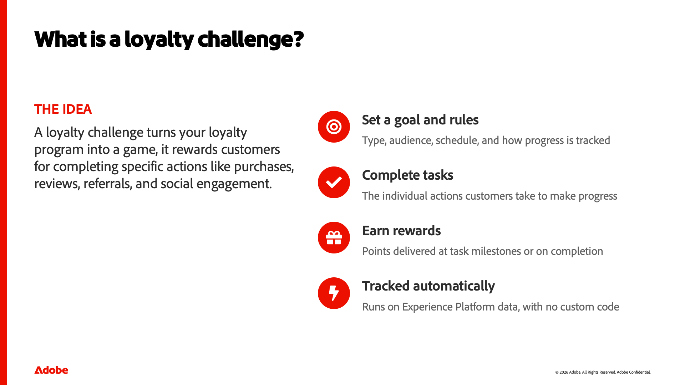

::::slides

:::intro

## Comprensión de los conceptos de desafío de lealtad

Antes de crear cualquier cosa en Adobe Journey Optimizer Loyalty, ayuda a comprender qué es un desafío de lealtad y de qué pocas piezas está hecho. Esta lección construye ese vocabulario compartido, qué es un desafío, sus componentes básicos de desafío, tareas y recompensas, los tipos de desafíos disponibles y cómo uno cobra vida, así que las lecciones prácticas que siguen tienen sentido.

:::

:::slide

### Comprensión de los conceptos de desafío de lealtad

Bienvenido. En esta lección creamos un vocabulario compartido para Adobe Journey Optimizer Loyalty. Antes de crear cualquier cosa, ayuda a comprender qué es realmente un desafío de lealtad y de qué pocas piezas básicas está hecho. Eso es lo que cubrimos aquí — los conceptos — así que las lecciones prácticas que siguen tienen sentido.

:::

:::slide

### ¿Qué es un desafío de lealtad?

Entonces, ¿qué es un desafío de lealtad? En su forma más simple, es una manera de convertir su programa de fidelidad en un juego. Recompensas a los clientes por realizar acciones específicas: realizar una compra, escribir una crítica, recomendar a un amigo, participar en actividades sociales. Un desafío establece un objetivo y las reglas para alcanzarlo. Los clientes progresan al completar las tareas, y terminarlas (o todo el desafío) les da recompensas. Y como todo se ejecuta en los datos de Experience Platform, el progreso se rastrea automáticamente, sin desarrollo personalizado.

:::

:::slide

### La anatomía de un desafío

Cada desafío está construido a partir de tres piezas, y estas son las tres palabras sobre las que anclar. En primer lugar, el desafío en sí: el objetivo general y sus reglas: el tipo, la audiencia, el cronograma y cómo se realiza el seguimiento del progreso. En segundo lugar, las tareas: las acciones individuales que realiza un cliente, como una compra o una revisión. Un desafío agrupa una o más tareas. Y tercero, las recompensas: lo que ganan los clientes, entregado ya sea en hitos de tareas individuales o cuando completan todo el desafío. Desafío, tareas, recompensas... si no recuerdan nada más, recuerden estos tres.

:::

:::slide

### Formas de estructurar un desafío

Los desafíos se presentan de varias formas, según el comportamiento que desee impulsar. Un desafío estándar permite a los clientes completar cualquier cantidad de tareas en cualquier orden, lo que aporta flexibilidad. Un desafío de Streak les pide que repitan la misma tarea consecutivamente: piensen en comprar café siete días seguidos. Un desafío secuencial requiere tareas en un orden establecido, lo cual es ideal para incorporar recorridos. Y hay un cuarto, Traiga sus propios datos, donde las tareas y recompensas provienen de su propia integración de lealtad, aunque esa ha restringido la disponibilidad hoy en día.

:::

:::slide

### De la idea al desafío vivo

Así es como esas piezas se juntan cuando construyes una. Comience creando el desafío y eligiendo su tipo. Puede configurar los ajustes: audiencia, programación y reglas. Le da estructura añadiendo tareas y recompensas. Puede diseñar el aspecto que tendrá para los clientes con tarjetas de contenido y, opcionalmente, configurar la mensajería para el lanzamiento, el progreso y la finalización. Por último, se inicia, publicando el desafío y generando el recorrido que rastrea el progreso de todos. Profundizamos en cada una de estas lecciones en lecciones posteriores; por ahora, solo noten la forma del flujo.

:::

:::slide

### Términos clave que se deben recordar

Vamos a bloquear el vocabulario. Un desafío es el objetivo general, el tipo y las reglas. Una tarea es una acción que realiza un cliente. Una recompensa es lo que ganan, en un hito o al completarse. Una tarjeta de contenido muestra el desafío en el dispositivo de un cliente. La mensajería cubre los momentos de inicio, en curso y finalización. Y el recorrido es el flujo generado automáticamente que rastrea el progreso entre bastidores. Verá los seis términos a lo largo del resto del curso.

Ese es el modelo mental. Ahora saben lo que es un desafío de lealtad, las tres piezas de las que está hecho, los tipos disponibles y cómo un desafío cobra vida. A continuación, abrimos el producto y realizamos un recorrido por el espacio de trabajo.

:::

:::slide

### &#x200B;

:::

::::
