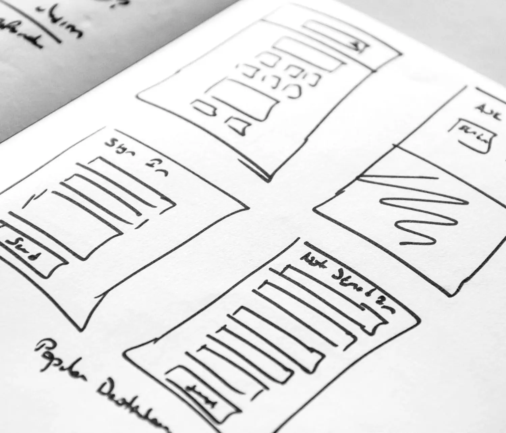

# Journey Optimizer: centro de aprendizaje móvil

Comience o suba de nivel con canales móviles en Adobe Journey Optimizer (AJO). Este es el espacio de referencia para desarrolladores, administradores, especialistas en marketing y analistas de datos para descubrir todo tipo de cosas, desde configurar canales móviles entrantes y salientes hasta convertirlos en campañas potentes. Explore las prácticas recomendadas, aprenda a impulsar la adopción y domine la creación de informes, todo en un solo lugar, para que los equipos puedan ofrecer experiencias móviles impactantes basadas en datos que se conecten con los usuarios en cualquier momento y en cualquier lugar.

>[!VIDEO](https://video.tv.adobe.com/v/3432681?quality=12&learn=on){transcript=true}

## Información general del canal móvil

Journey Optimizer admite canales móviles entrantes y salientes:

### Canales de salida

Los canales salientes se utilizan para **enviar mensajes de forma proactiva** a los clientes sin que sea necesario interactuar previamente. Son ideales para campañas, promociones y comunicaciones transaccionales.

| {width=&quot;250&quot;, height=&quot;250&quot;}  **[Notificaciones Push](/help/mobile-learning-hub/channels/push-notifications-overview.md)** | {width=&quot;250&quot;, height=&quot;250&quot;}  **[SMS / MMS / RCS](/help/mobile-learning-hub/channels/sms-mms-rcs-overview.md)** | {width=&quot;250&quot;, height=&quot;250&quot;}  **[WhatsApp](/help/mobile-learning-hub/channels/whatsapp-overview.md)** |
|-------------------------------------|------------------------------------|-------------------------------|
| Enviados fuera de la aplicación, los mensajes push llaman la atención inmediatamente. Son perfectas para actualizaciones que requieren tiempo y para animar a los usuarios a volver a su aplicación. | Mensajes directos enviados a los teléfonos móviles de los usuarios sin necesidad de la aplicación. Ideal para alertas urgentes, recordatorios y contenido con medios enriquecidos, como imágenes o vídeos. | Canal de conversación a través de una aplicación de mensajería ampliamente utilizada, que permite comunicaciones personalizadas y bidireccionales y campañas interactivas. |

> Los canales salientes aplican **directivas de consentimiento personalizadas** en el momento del envío del mensaje. Si no se concede el consentimiento para una acción de marketing específica, el mensaje se bloquea de la entrega.

## Canales entrantes

Los canales entrantes están diseñados para **interacciones iniciadas por el cliente**, lo que permite experiencias personalizadas cuando los usuarios interactúan con su marca.

| {width=&quot;250&quot;,height=&quot;50%&quot;}  **[Mensajes en la aplicación](/help/mobile-learning-hub/channels/in-app-messages-overview.md)** | {width=&quot;250&quot;, height=&quot;250&quot;}  **[Tarjetas de contenido](/help/mobile-learning-hub/channels/content-cards-overview.md)** | {width=&quot;250&quot;, height=&quot;250&quot;}  **[Experiencia basada en código](/help/mobile-learning-hub/channels/code-based-experience-overview.md)** |
|-------------------------------------|------------------------------------|-------------------------------|
| Se envían mientras los usuarios utilizan activamente la aplicación; estos mensajes son interactivos y en tiempo real. Son perfectas para atraer a los clientes en este momento. | Los usuarios pueden acceder en cualquier momento desde la aplicación a mensajes persistentes y no intrusivos. Las tarjetas de contenido funcionan bien para compartir ofertas continuas o información útil. | Los mensajes personalizados permiten campañas altamente personalizadas y dinámicas, que integran datos en tiempo real y recorridos de cliente complejos. |

> Los canales entrantes admiten **personalización en tiempo real** y **captura de datos**, como formularios de páginas de aterrizaje que se alimentan de Adobe Experience Platform (AEP) para la segmentación y el direccionamiento.

## ¿Cómo pueden funcionar juntos los canales móviles?

Al combinar estos canales, puede crear una experiencia del cliente perfecta y eficaz:

1. Use **notificaciones push** para llamar la atención rápidamente y devolver a los usuarios a su aplicación (por ejemplo, &quot;¡La venta comienza ahora!&quot;).

2. Una vez dentro, envía **mensajes en la aplicación** con promociones personalizadas (por ejemplo, &quot;Aquí tienes tu descuento del 15% para la venta de hoy&quot;).

3. Ofrezca **tarjetas de contenido** para que los usuarios puedan volver a visitar la promoción en cualquier momento antes de que caduque (por ejemplo, &quot;Su descuento del 15% termina el viernes&quot;).

4. Use **SMS/MMS/RCS** para enviar recordatorios puntuales u ofertas de medios enriquecidos directamente a los usuarios que no estén en la aplicación.

5. Enganche a los clientes en conversaciones significativas a través de **WhatsApp**, ideal para soporte al cliente o campañas interactivas.

6. Aproveche las **experiencias basadas en código** para adaptar cada mensaje en función de las preferencias y el comportamiento del usuario, creando un recorrido verdaderamente personalizado en todos los canales.

## Casos de uso del cliente

* [Tomar vuelo con personalización: Cómo las aerolíneas pueden elevar ofertas con Adobe Journey Optimizer (blog)](https://experienceleaguecommunities.adobe.com/t5/journey-optimizer-blogs/take-flight-with-personalization-how-airlines-can-elevate-offers/ba-p/767513?profile.language=es)

## Construya su base

Aprenda los conceptos y cómo

<table style="table-layout:fixed">
  <tr style="border: 0;">
    <td>
    
    
<strong>Configurar y lanzar</strong> Configurar los canales móviles e integrarlos con aplicaciones móviles.

    </td>
    <td>
    
    
<strong>Diseña y entrega</strong> Utiliza canales móviles para crear recorridos personalizados y campañas que atraigan a los clientes en tiempo real.

    </td>
    <td>
    
    
<strong>Medir y optimizar</strong> Acceda a informes, analice el rendimiento y perfeccione estrategias para obtener mejores resultados.
    

    </td>
  </tr>
</table>

## Casos habituales de uso empresarial de Mobile

| Caso de uso | Descripción | Uso del canal móvil |
|---------|-------------|----------------------|
| **Incorporación y adopción de la aplicación** | Guía a los nuevos usuarios a través de las etapas iniciales de la participación con la aplicación: la instalación de la aplicación, la finalización de la configuración y el descubrimiento de funciones clave. El objetivo es maximizar la retención y el uso a largo plazo. | - Notificaciones push y SMS de bienvenida a los usuarios y finalización rápida del perfil. : los mensajes en la aplicación resaltan características y recomiendan las primeras acciones. : los vínculos profundos en correos electrónicos o anuncios dirigen a los usuarios a pantallas de aplicación específicas para una incorporación perfecta. |
| **Participación basada en la ubicación** | Envía mensajes personalizados y oportunos a los usuarios en función de su proximidad física a tiendas, eventos u otras ubicaciones relevantes. | : notificaciones push de déclencheur técnico de señalización y geoperimetraje cuando los usuarios entran en zonas de destino. : los SMS/MMS envían ofertas y actualizaciones localizadas. : los titulares y las tarjetas en la aplicación adaptan el contenido en función de la ubicación en tiempo real. |
| **Renovación del compromiso de abandono** | Se dirige a los usuarios que abandonan los carros de compras, los formularios o las sesiones de navegación, con el fin de recuperarlos y completar la acción deseada. | : Las notificaciones push recuerdan a los usuarios de carros de compras abandonados o acciones incompletas. : los seguimientos de SMS incluyen incentivos o vínculos directos para reanudar. : aparecen mensajes en la aplicación cuando los usuarios regresan y ofrecen recomendaciones personalizadas. |
| **Campañas de ampliación y venta cruzada** | Promociona productos adicionales o actualizaciones para clientes existentes en función de su comportamiento, preferencias o historial de compras. | : Las notificaciones push resaltan las oportunidades relevantes de ampliación de venta. : los mensajes en la aplicación y las tarjetas de contenido muestran elementos complementarios. : las campañas de SMS se dirigen a audiencias segmentadas con ofertas exclusivas. |
| **Prevención de pérdida** | Identifica a los usuarios en riesgo de abandonarlos y los involucra con estrategias de retención personalizadas para mantener la lealtad. | : déclencheur de análisis predictivo con alcance móvil para usuarios en riesgo. : notificaciones push y SMS ofrecen recompensas por fidelidad o contenido personalizado. : las encuestas en la aplicación recopilan comentarios para mejorar las estrategias de retención. |
| **Mensajería multicanal** | Orquesta mensajes coherentes en varios canales móviles para garantizar que los usuarios reciban comunicaciones oportunas y relevantes. | : push, en la aplicación, SMS y correo electrónico están coordinados para la mensajería unificada. : los SDK permiten la personalización en tiempo real entre canales. : las tarjetas de contenido persisten entre sesiones para reforzar los mensajes clave. |

