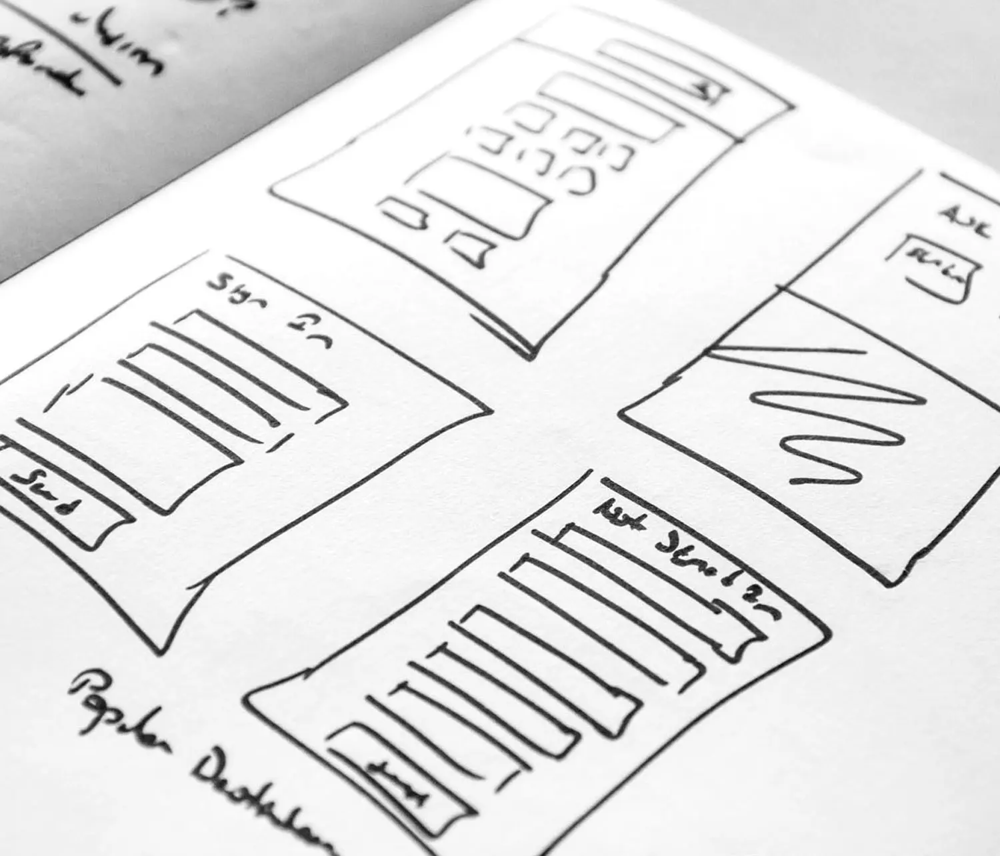
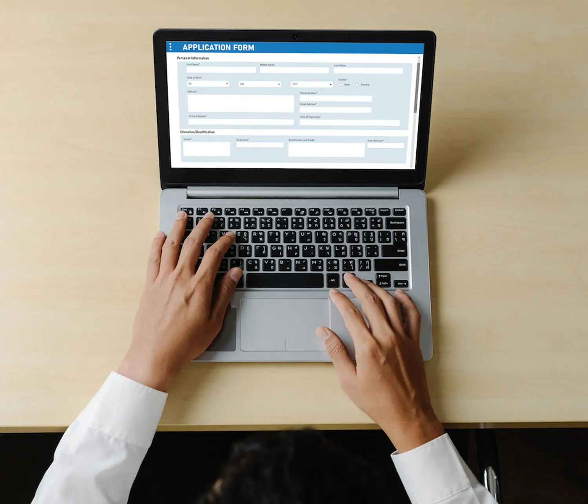

# Journey Optimizer - Mobile Learning Hub

Comience o aumente su estrategia de participación móvil con Adobe Journey Optimizer. El centro de aprendizaje móvil proporciona a desarrolladores, administradores, expertos en marketing y analistas todo lo necesario para configurar canales móviles de entrada y de salida, e integrarlos perfectamente en potentes recorridos y campañas en canales múltiples.

Explore best practices, learn how to drive adoption, and setup centralized reporting workflows — all in one place — to deliver impactful, data-driven mobile experiences that reach customers anytime, anywhere.

>[!VIDEO](https://video.tv.adobe.com/v/3477001?captions=spa&quality=12&learn=on){transcript=true}

## Mobile channel overview

Journey Optimizer supports both inbound and outbound mobile channels:

### Canales de salida

Outbound channels let you proactively deliver messages to customers without requiring a prior interaction. These interactions are ideal for campaigns, promotions, or transactional events.

All outbound channels in Adobe Journey Optimizer enforce Custom Consent Policies at message send time. If consent is not granted for a specific marketing action, the message is automatically suppressed to ensure compliant delivery.

| {width=&quot;250&quot;, height=&quot;250&quot;}  **[Push Notifications](/help/mobile-learning-hub/channels/push-notifications-overview.md)** | {width=&quot;250&quot;, height=&quot;250&quot;}  **[SMS / MMS / RCS](/help/mobile-learning-hub/channels/sms-mms-rcs-overview.md)** | {width=&quot;250&quot;, height=&quot;250&quot;}  **[WhatsApp](/help/mobile-learning-hub/channels/whatsapp-overview.md)** |
|-------------------------------------|------------------------------------|-------------------------------|
| Sent outside the app, push messages grab attention immediately. They&#39;re ideal for time-sensitive updates and encouraging users to return to your app. | Direct messages sent to users&#39; mobile phones without needing the app. Great for urgent alerts, reminders, and rich media content like images or videos. | Conversational channel through a widely used messaging app, allowing personalized, two-way communication and interactive campaigns. |

### Canales de entrada

Inbound channels support customer-initiated interactions, allowing you to deliver personalized experiences the moment users engage with your brand. They enable real-time personalization and data capture—such as landing page forms or on-site behaviors—that feed directly into Adobe Experience Platform (AEP) for segmentation, targeting, and activation across journeys.

| {width=&quot;250&quot;,height=&quot;50%&quot;}  **[In-App Messages](/help/mobile-learning-hub/channels/in-app-messages-overview.md)** | {width=&quot;250&quot;, height=&quot;250&quot;}  **[Content Cards](/help/mobile-learning-hub/channels/content-cards-overview.md)** | {width=&quot;250&quot;, height=&quot;250&quot;}  **[Code-Based Experience](/help/mobile-learning-hub/channels/code-based-experience-overview.md)** |
|-------------------------------------|------------------------------------|-------------------------------|
| Delivered while users are actively using your app, these messages are real-time and interactive. They&#39;re perfect for engaging customers in the moment. | Non-intrusive, persistent messages users can access anytime within the app. Content cards work well for sharing ongoing offers or helpful information. | Custom-coded messages enable highly personalized and dynamic campaigns, integrating real-time data and complex customer journeys. |

### How can mobile channels work together?

By combining these channels, you can create a seamless and effective customer experience:

1. Use [push notifications](/help/mobile-learning-hub/channels/push-notifications-overview.md) to quickly grab attention and bring users back to your app (e.g., &quot;Sale starts now!&quot;).

2. Once inside, deliver [in-app messages](/help/mobile-learning-hub/channels/in-app-messages-overview.md) with personalized promotions (e.g., &quot;Here&#39;s your 15% discount for today&#39;s sale&quot;).

3. Offer [content cards](/help/mobile-learning-hub/channels/content-cards-overview.md) so users can revisit the promotion anytime before it expires (e.g., &quot;Your 15% discount ends Friday&quot;).

4. Use [SMS/MMS/RCS](/help/mobile-learning-hub/channels/sms-mms-rcs-overview.md) to send timely reminders or rich media offers directly to users who may not be in the app.

5. Engage customers in meaningful conversations through [WhatsApp](/help/mobile-learning-hub/channels/whatsapp-overview.md), ideal for customer support or interactive campaigns.

6. Leverage [code-based experiences](/help/mobile-learning-hub/channels/code-based-experience-overview.md) to tailor every message based on user behavior and preferences, creating a truly personalized journey across channels.

## Build your foundation

Learn the concepts and how to

<table style="table-layout:fixed">
  <tr style="border: 0;">
    <td>
    
    
<strong>Configure &amp; Launch</strong> Configure the mobile channeles and integrate with mobile apps.

    </td>
    <td>
    
    
<strong>Design &amp; Deliver</strong> Use mobile channels to build personalized journeys and campaigns that engage customers in real time.

    </td>
    <td>
    
    
<strong>Measure &amp; Optimize</strong> Access reports, analyze performance, and refine strategies for better outcomes.
    

    </td>
  </tr>
</table>

## Common Mobile Business Use Cases

| Caso de uso | Descripción | Mobile Channel Usage |
|---------|-------------|----------------------|
| **App Onboarding and Adoption** | Guides new users through the initial stages of app engagement—installing the app, completing setup, and discovering key features. El objetivo es maximizar la retención y el uso a largo plazo. | - Notificaciones push y SMS dan la bienvenida a los usuarios y solicitan la finalización del perfil. - Los mensajes en la aplicación resaltan las características y fomentan las primeras acciones. - Los vínculos profundos en correos electrónicos o anuncios dirigen a los usuarios a pantallas específicas de la aplicación para una incorporación sin problemas. |
| **Participación basada en la ubicación** | Envía mensajes personalizados y oportunos a los usuarios en función de su proximidad física a tiendas, eventos u otras ubicaciones relevantes. | - Notificaciones push de déclencheur técnico de señalización y geovallas cuando los usuarios entran en las zonas de destino. - Los SMS/MMS ofrecen ofertas y actualizaciones localizadas. - Los banners y las tarjetas en la aplicación adaptan el contenido en función de la ubicación en tiempo real. |
| **Renovación del compromiso de abandono** | Se dirige a los usuarios que abandonan los carros de compras, los formularios o las sesiones de navegación, con el fin de recuperarlos y completar la acción deseada. | - Las notificaciones push recuerdan a los usuarios de carros de compras abandonados o acciones incompletas. - Los seguimientos de SMS incluyen incentivos o vínculos directos para reanudar. - Aparecen mensajes en la aplicación cuando los usuarios regresan, ofreciendo recomendaciones personalizadas. |
| **Campañas de ampliación y venta cruzada** | Promociona productos adicionales o actualizaciones para clientes existentes en función de su comportamiento, preferencias o historial de compras. | - Las notificaciones push resaltan oportunidades de ampliación de venta relevantes. - Los mensajes en la aplicación y las tarjetas de contenido muestran elementos complementarios. - Las campañas de SMS se dirigen a audiencias segmentadas con ofertas exclusivas. |
| **Prevención de pérdida** | Identifica a los usuarios en riesgo de abandonarlos y los involucra con estrategias de retención personalizadas para mantener la lealtad. | - Alcance móvil de déclencheur de análisis predictivo para usuarios en riesgo. - Las notificaciones push y los SMS ofrecen recompensas por fidelidad o contenido personalizado. - Las encuestas en la aplicación recopilan comentarios para mejorar las estrategias de retención. |
| **Mensajería multicanal** | Orquesta mensajes coherentes en varios canales móviles para garantizar que los usuarios reciban comunicaciones oportunas y relevantes. | - Las notificaciones push, en la aplicación, los SMS y el correo electrónico se coordinan para la mensajería unificada. - Los SDK permiten la personalización en tiempo real entre canales. - Las tarjetas de contenido persisten entre sesiones para reforzar los mensajes clave. |

## Casos de uso del cliente

* [Vuelo con personalización: Cómo las aerolíneas pueden elevar ofertas con Adobe Journey Optimizer (blog)](https://experienceleaguecommunities.adobe.com/t5/journey-optimizer-blogs/take-flight-with-personalization-how-airlines-can-elevate-offers/ba-p/767513?profile.language=es)
