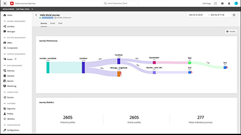

# Tutorials de Journey Optimizer: información general

Journey Optimizer ayuda a las empresas a ofrecer a sus clientes experiencias conectadas, contextuales y personalizadas. El recorrido del cliente es todo el proceso de interacción de un cliente con la marca, desde el primer momento de contacto hasta que se marcha del sitio.

Esta guía del usuario contiene vídeos y tutoriales sobre las numerosas funciones y funcionalidades de Adobe Journey Optimizer.

## Novedades

### Tutoriales

* **[Copiar un recorrido en otro simulador de pruebas](/help/create-journeys/copy-a-journey.md)**

   *Aprenda a copiar un recorrido y sus objetos dependientes de un simulador para pruebas a otro.*

* **[Enmascarar datos en mensajes](/help/privacy/mask-data-in-messages.md)**

   *Comprender qué es el enmascaramiento de datos y por qué enmascarar datos. Aprenda a ocultar datos en mensajes de Journey Optimizer.*

* **[Creación de una campaña](/help/create-champaigns/create-a-campaign.md)**

   *Obtenga información sobre cómo enviar contenido de una sola vez a una audiencia específica ejecutando acciones inmediatamente o según una programación especificada.*

* **[Configuración, creación y entrega de mensajes SMS](/help/create-messages/configure-author-and-deliver-sms-messages.md)**

   *Obtenga información sobre cómo configurar, crear e incluir mensajes SMS en sus recorridos de cliente.*

### Eventos en directo de Experience League

* **[Notificaciones push con Adobe Journey Optimizer](https://experienceleague.adobe.com/docs/experience-league-live-events/events/episodes/exl-live-episode-05-12-22.html?lang=es)**

   *En este episodio en directo de Experience League, hablamos sobre los casos de uso comunes de las notificaciones push con Adobe Journey Optimizer y descubra los detalles técnicos sobre cómo configurar una aplicación para notificaciones push con tecnología Adobe Experience Platform.*

## Selección del personal

<table>
<tr>
  <td>
    
    

      <a href="./introduction/journey-optimizer-overview-part-1.md">
    <strong>Información general de Journey Optimizer, parte 1 </strong>
    </a>
    

    

    <em>Este vídeo muestra cómo las marcas pueden utilizar la optimización del recorrido de Adobe para ofrecer recorridos omnicanal personalizados a sus consumidores.</em>
    

  </td>
    <td>
    
    

      <a href="./introduction/journey-optimizer-overview-part-2.md">
    <strong>Información general de Journey Optimizer, parte 2 </strong>
    </a>
    

    

    <em>Este vídeo muestra cómo las marcas pueden utilizar gestión de decisiones, la calificación de segmentos en tiempo real y la administración de eventos empresariales de Adobe Journey Optimizer para llevar los recorridos de sus consumidores a otro nivel.</em>
    

  </td>
  </td>
    <td>
    
    

      <a href="./decision-management/create-decisions.md">
    <strong>Introducción a las capacidades de gestión de decisiones </strong>
    </a>
    

    

    <em>El vídeo abarca los desafíos comerciales que resuelven las capacidades de gestión de decisiones, sus funciones clave, la arquitectura básica y sus principales casos de uso.

</em>
    

  </td>
</tr>
<tr>
  <td>
    
    

      <a href="./create-journeys/use-case-transactional-journey.md">
    <strong>Caso de uso: Recorrido transaccional </strong>
    </a>
    

    

    <em>Comprenda los casos de uso aplicables para los recorridos transaccionales. Obtenga información sobre cómo crear recorridos transaccionales y qué prácticas recomendadas aplicar.</em>
    

  </td>
    <td>
    
    

      <a href="./personalize-content/use-contextual-event-information-for-personalization.md">
    <strong>Uso de información de evento contextual para la personalización </strong>
    </a>
    

    

    <em>Aprenda a utilizar la información de evento contextual de un recorrido para personalizar un mensaje.</em>
    

  </td>
  </td>
    <td>
    
    

      <a href="./report-and-monitor/live-and-global-reports.md">
    <strong>Informes en vivo y globales </strong>
    </a>
    

    

    <em>Conozca la diferencia entre los informes en vivo y globales, cómo acceder y analizar los informes específicos de recorrido y mensaje, y cómo modificar los tableros de informes.

</em>
    

  </td>
</tr>
</table>
