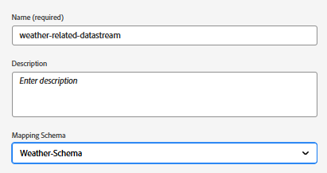

# Configuración de esquemas, conjuntos de datos y flujos de datos XDM en AEP

## Crear esquema XDM

Para utilizar Adobe Experience Platform Web SDK (Alloy.js) en una página web, las etiquetas de AEP deben asociarse a una secuencia de datos asignada a un esquema de eventos XDM. La SDK web (alloy.sendEvent) envía datos a AEP como eventos de experiencia, que deben ajustarse a un esquema XDM basado en la clase XDM ExperienceEvent.

Para crear un esquema XDM

* Iniciar sesión en Adobe Experience Platform
* Administración de datos -> Esquemas -> Crear esquema

* Cree un esquema basado en eventos XDM llamado **_Weather-Schema_**. Si no está familiarizado con la creación de un esquema, siga esta [documentación](https://experienceleague.adobe.com/es/docs/experience-platform/xdm/tutorials/create-schema-ui)

* Asegúrese de que el esquema tenga los siguientes campos con el tipo de datos adecuado.

## Crear un conjunto de datos basado en el esquema

Un conjunto de datos **en Adobe Experience Platform (AEP)** es un contenedor de almacenamiento estructurado que se usa para ingerir, almacenar y activar datos basados en un esquema XDM definido.

* Administración de datos -> Conjuntos de datos -> Crear conjunto de datos
* Cree un conjunto de datos llamado **_Weather-schema-dataset_** basado en el esquema XDM(_&#x200B;**Weather-Schema**&#x200B;_) creado en el paso anterior.

## Crear una secuencia de datos

Un conjunto de datos en Adobe Experience Platform es como un canal seguro (o autopista) que conecta su sitio web o aplicación a los servicios de Adobe, lo que permite que los datos ingresen y que el contenido personalizado regrese.

* Vaya a Recopilación de datos > Flujos de datos y haga clic en Nuevo flujo de datos. Asigne un nombre a la secuencia de datos **weather-related-datastream**

* Proporcione los siguientes detalles como se muestra en la captura de pantalla siguiente
  
* Haga clic en Guardar, luego haga clic en Agregar asignación y agregue el servicio de Adobe Experience Platform y el conjunto de datos de evento con las casillas de verificación adecuadas seleccionadas
  

* Guarde la secuencia de datos.
