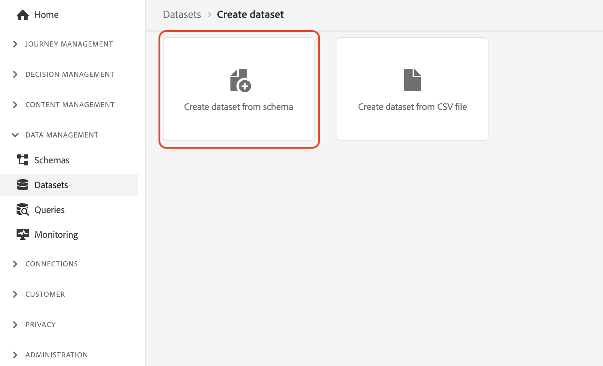

# Ingesta manual de datos

Esta sección le guía a través de los pasos necesarios para crear conjuntos de datos e introducir datos de ejemplo.

>[!TIP]
>
> Ver el tutorial en vídeo [Creación de conjuntos de datos e ingesta de datos](/help/set-up-data/create-datasets-and-ingest-data.md) antes de empezar.

Creará cinco [!UICONTROL conjuntos de datos] basado en la Luma [!UICONTROL esquemas] creado en la variable [sección anterior](/help/tutorial-configure-a-training-sandbox/manual-data-set-up.md). Una vez creados los conjuntos de datos, puede ingerir datos de los archivos JSON que descargó y modificó. (Consulte [Introducción y requisitos previos](/help/tutorial-configure-a-training-sandbox/introduction-and-prerequisites.md) para instrucciones).

## Crear el primer conjunto de datos

Crear un conjunto de datos con el nombre *[!DNL Luma Loyalty Data]* from [!DNL Luma Loyalty schema]

1. Desde la navegación izquierda, debajo de [!UICONTROL ADMINISTRACIÓN DE DATOS], seleccione **[!UICONTROL Conjuntos de datos]**.

1. Select **[!UICONTROL Crear conjunto de datos]**.

   

1. En la página siguiente, seleccione [!UICONTROL Crear conjunto de datos a partir del esquema].

   

1. En la página siguiente, busque la variable *[!DNL Luma Loyalty]* que creó anteriormente.

1. Seleccione *[!DNL Luma Loyalty]*.

1. Haga clic en **[!UICONTROL Siguiente]**.

   

1. Configure el conjunto de datos:

   * Nombre: `Luma Loyalty Data`

1. Haga clic en **[!UICONTROL Finalizar]**.

   

## Ingesta de datos de ejemplo

Después de crear un conjunto de datos, puede ingerir datos en el conjunto de datos.

1. En el [!DNL Luma Loyalty Data] , desplácese hacia abajo en la parte inferior del panel derecho hasta la página [!UICONTROL AÑADIR DATOS] y habilite:

   * **[!UICONTROL Diagnóstico de errores]** y

   * **[!UICONTROL Ingesta parcial]**

   

1. Arrastre y suelte la `luma-loyalty.json` para cargar datos de ejemplo en el conjunto de datos.

1. Actualice la página y compruebe el estado del lote para confirmar que el archivo se ha introducido correctamente.

   375 registros deben haberse ingerido. Los datos podrían tardar un par de minutos en ingerirse.

>[!TIP]
>
>Si el lote falla, asegúrese de haber reemplazado el ID de organización en la variable `luma-loyalty.json` con [ID de organización](https://experienceleague.adobe.com/docs/core-services/interface/administration/organizations.html?lang=es).

## Crear cinco adicionales [!UICONTROL conjuntos de datos]

A continuación, cree los cinco adicionales siguientes: [!UICONTROL conjuntos de datos] e ingerir los datos en la variable `Luma CRM Data`, el `Luma Products Data`y `Luma Test Profiles` conjuntos de datos.

| Nombre del conjunto de datos | Desde esquema | Archivo a ingerir | Registros |
| -----| ------ | -------| ------- |
| `Luma CRM Data` | `Luma CRM` | `luma-crm.json` | 500 |
| `Luma Products Data` | `Luma Products` | `luma-products.json` | 92 |
| `Luma Product Interactions Data` | `Luma Product Interactions` | ninguna | 0 |
| `Luma Product Inventory Events` | `Luma Product Inventory Events` | ninguna | 0 |
| `Luma Test Profiles` | `Luma Test Profiles` | `luma-test-profiles.json` | 3 |

## Pasos siguientes

Ha creado correctamente todos los conjuntos de datos necesarios e introducido los datos de ejemplo. El paso final es [configurar eventos](/help/tutorial-configure-a-training-sandbox/configure-events.md).
