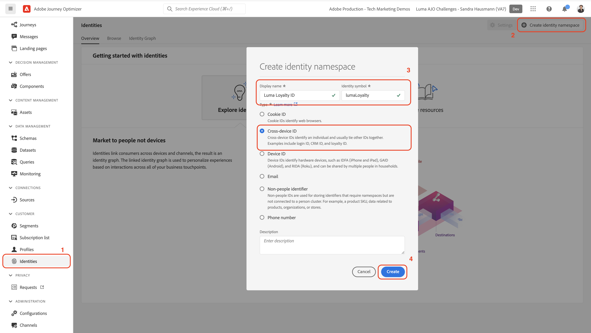

# Configuración manual de datos

En esta sección, se crean los espacios de nombres de identidad necesarios y se define la variable [!DNL Luma] estructura de datos de ejemplo creando la variable [[!UICONTROL esquemas]](https://experienceleague.adobe.com/docs/experience-platform/xdm/schema/composition.html?lang=es).

>[!TIP]
>Ver el tutorial en vídeo [Asigne identidades](/help/set-up-data/map-identities.md) antes de empezar.

## Paso 1: Crear áreas de nombres de identidad

En este paso, se crean áreas de nombres de identidad para la variable [!DNL Luma] campos de identidad personalizados con nombre `lumaLoyaltyId`, `lumaCrmId`y `lumaProductSKU`. Las áreas de nombres de identidad desempeñan un papel fundamental en la creación de perfiles de clientes en tiempo real, ya que dos valores coincidentes en el mismo espacio de nombres permiten que dos fuentes de datos formen un gráfico de identidad.

Comience creando un [!UICONTROL namespace] para el [!DNL Luma Loyalty ID] esquema:

1. En la interfaz de usuario de Journey Optimizer, vaya a ***[!UICONTROL Cliente]** > **[!UICONTROL Identidades]** en el panel de navegación izquierdo.

1. Select **[!UICONTROL Crear área de nombres de identidad]**.

1. Proporcione los siguientes detalles:

   | Nombre para mostrar | Símbolo de identidad | Tipo |
   |---|---|---|
   | `Luma Loyalty ID` | `lumaLoyaltyId` | [!UICONTROL ID entre dispositivos] |

1. Seleccione **[!UICONTROL Crear]**.

   

1. Cree dos áreas de nombres más siguiendo los mismos pasos:

   | Nombre para mostrar | Símbolo de identidad | Tipo |
   |---|---|---|
   | `Luma CRM ID` | `lumaCrmId` | [!UICONTROL ID entre dispositivos] |
   | `Luma Product SKU` | `lumaProductSKU` | [!UICONTROL Identificador de no personas] |

## Paso 2: Crear esquemas

En este paso, se define la estructura de los datos de ejemplo creando seis [[!UICONTROL esquemas]](https://experienceleague.adobe.com/docs/experience-platform/xdm/schema/composition.html?lang=es):

* [[!DNL Luma Loyalty Schema]](#create-luma-loyalty-schema)

* [[!DNL Luma Product Catalog Schema]](#create-luma-product-catalog-schema)

* [[!DNL Luma Product Inventory Events] Esquema](#create-luma-product-inventory-event-schema)

* [[!DNL Luma CRM Schema]](#create-luma-crm-and-luma-product-interactions-schemas)

* [[!DNL Luma Web Events Schema]](#create-luma-crm-and-luma-product-interactions-schemas)

* [[!DNL Luma Offline Purchase Events Schema]](#create-additional-schemas)

* [[!DNL Luma Test Profiles Schema]](#create-additional-schemas)

>[!TIP]
>
>Vea el videotutorial: [Crear un esquema](/help/set-up-data/create-schema.md) antes de empezar.

### Crear [!DNL Luma Loyalty] [!UICONTROL Esquema] {#create-luma-loyalty-schema}

#### Creación del esquema

Comience creando la [!DNL Luma Loyalty] esquema:

1. Vaya a **[!UICONTROL ADMINISTRACIÓN DE DATOS]** > **[!UICONTROL Esquemas]** en el panel de navegación izquierdo.

1. Select **[!UICONTROL Crear esquema]** en la parte superior derecha.

1. En el menú desplegable, seleccione **[!UICONTROL Perfil individual XDM]**, ya que está modelando atributos de un cliente individual (puntos, estado, etc.).

#### Agregar grupos de campos existentes

A continuación, se le pedirá que añada grupos de campos al esquema. Agregue todos los campos a esquemas mediante grupos. Se añaden grupos de campos existentes y se debe crear un grupo de campos.

>[!NOTE]
>
>Si la variable [!UICONTROL Grupos de campo] modal no se abre automáticamente en el [!UICONTROL Esquemas] página, seleccione **[!UICONTROL Agregar]** (como se muestra en la siguiente imagen).

1. En el **[!UICONTROL Agregar grupos de campos]** , habilite los siguientes grupos de campos:

   * **[!UICONTROL Detalles demográficos]** para datos básicos del cliente como nombre y fecha de nacimiento.

   * **[!UICONTROL Detalles de contacto personal]** para obtener detalles básicos de contacto como la dirección de correo electrónico y el número de teléfono.

   * **[!UICONTROL Detalles de fidelidad]** para los detalles de lealtad, como puntos, fecha unida o estado. El grupo de campos de lealtad está muy por debajo de la lista, por lo que es más fácil buscarlo.

1. Select **[!UICONTROL Agregar grupo de campos]** para agregar los tres grupos de campos al esquema.

   

1. Seleccione el nodo superior del esquema.

1. Entrar `Luma Loyalty Schema` como el [!UICONTROL Nombre para mostrar].

#### Cree un [!UICONTROL grupo de campos]

Para ayudar a garantizar la coherencia en los esquemas, Adobe recomienda administrar todos los identificadores del sistema en un solo grupo:

1. En el **[!UICONTROL Composición]** sección bajo [!UICONTROL Grupos de campo], seleccione **[!UICONTROL Agregar]**.

1. Select **[!UICONTROL Crear nuevo grupo de campos]**.

1. Agregar `Luma Identity Profile Field Group` como el **[!UICONTROL Nombre para mostrar]**.

1. Agregar `system identifiers for XDM Individual Profile class` como el **[!UICONTROL Descripción]**.

1. Select **[!UICONTROL Agregar grupos de campos]**.

   

#### Añadir campos a la nueva [!UICONTROL grupo de campos]

El nuevo grupo de campos vacío se agrega al esquema . Con los botones +, puede añadir campos nuevos a cualquier ubicación de la jerarquía. En este caso, debe añadir campos en el nivel raíz:

1. Select **[!UICONTROL +]** junto al nombre del esquema.

   Este paso agrega un campo debajo de **su id de inquilino** para administrar los conflictos entre los campos personalizados y los campos estándar.

1. En el **[!UICONTROL Propiedades del campo]** barra lateral, añada los detalles del nuevo campo:

   * **Nombre del campo:** `systemIdentifier`

   * **[!UICONTROL Nombre para mostrar]:** `System Identifier`

   * **Tipo:** Objeto

   * **[!UICONTROL Asignar grupo de campos]:** [!DNL Luma identifiers]

1. Select **[!UICONTROL Aplicar]**.

   

   Agregue dos campos debajo de la variable `systemIdentifier` objeto:

   | [!UICONTROL Fieldname] | [!UICONTROL Nombre para mostrar] | [!UICONTROL Tipo] |
   |-------------|-----------|----------|
   | `loyaltyId` | `Loyalty Id` | [!UICONTROL Cadena] |
   | `crmId` | `CRM Id` | [!UICONTROL Cadena] |

#### Establecer identidades

Ahora tiene la variable [!UICONTROL namespace] y [!DNL Luma Loyalty schema] configurado. Para poder introducir datos, debe etiquetar los campos de identidad. Cada esquema utilizado con [!UICONTROL Perfil del cliente en tiempo real] es necesario que se especifique una identidad principal y cada registro ingerido debe tener un valor para ese campo.

1. Configure las variables **identidad principal**:

   En el **[!DNL Luma Loyalty Schema]**:

   1. Seleccione el **[!DNL Luma Identity Profile Field Group]**.

   2. Seleccione el campo **[!DNL loyaltyId]**.

   3. En el **[!UICONTROL Propiedades del campo]**, habilite el **[!UICONTROL Identidad]** en la ventana

   4. Active la variable **[!UICONTROL Identidad principal]** en la ventana

   5. Seleccione el `Luma Loyalty Id` espacio de nombres de **[!UICONTROL Espacios de nombres de identidad]** lista desplegable.

   6. Select **[!UICONTROL Aplicar]**.

      

2. Configure un **identidad secundaria**:

   En el **[!DNL Luma Loyalty Schema]**:

   1. Seleccione el **[!DNL Luma Identity Profile Field Group]**.

   2. Seleccione el campo `crmId`.

   3. En el **[!UICONTROL Propiedades del campo]**, habilite el **[!UICONTROL Identidad]** en la ventana

   4. Seleccione el `Luma CRM Id` espacio de nombres de **[!UICONTROL Espacios de nombres de identidad]** lista desplegable.

   5. Select **[!UICONTROL Aplicar]**.

#### Habilitar para perfil y guardar el esquema

1. Seleccione el nodo superior del esquema.

1. En el [!UICONTROL Propiedades del campo], habilitar **[!UICONTROL Perfil]**.

   El esquema debería tener este aspecto:

   

1. Seleccione **[!UICONTROL Guardar]**.

### Crear [!DNL Luma Product catalog Schema] {#create-luma-product-catalog-schema}

1. Vaya a [!UICONTROL ADMINISTRACIÓN DE DATOS] -> **[!UICONTROL Esquemas]** en el panel de navegación izquierdo.

1. Seleccione el **[!UICONTROL Crear esquema]** en la parte superior derecha.

1. En el menú desplegable, seleccione **[!UICONTROL Examinar todos los tipos de esquema]**, que le permite crear una clase.

1. Seleccione **[!UICONTROL Crear nueva clase].

1. Añada el nombre para mostrar: `Luma Product Catalog Class`.

1. Asignar clase.

1. Cree un [!UICONTROL grupo de campos]:

   * Nombre para mostrar: `Luma Product Catalog Field Group`

1. Agregue el siguiente campo al **[!DNL Luma Product Catalog Field Group]**.

   * Nombre del campo: `product`

   * Nombre para mostrar: `Product`

   * Tipo: [!UICONTROL Objeto]

   * Grupo de campos: [!DNL Luma Product Catalog Field Group]

1. Select **[!UICONTROL Aplicar]**.

1. Agregue los campos siguientes al **[!DNL Product]** objeto:

   | [!UICONTROL Fieldname] | [!UICONTROL Nombre para mostrar] | [!UICONTROL Tipo] |
   |-------------|-----------|----------|
   | `sku` | `Product SKU` | [!UICONTROL Cadena] |
   | `name` | `Product Name` | [!UICONTROL Cadena] |
   | `category` | `Product Category` | [!UICONTROL Cadena] |
   | `color` | `Product Color` | [!UICONTROL Cadena] |
   | `size` | `Product Size` | [!UICONTROL Cadena] |
   | `price` | `Product Price` | [!UICONTROL Doble] |
   | `description` | `Product Description` | [!UICONTROL Cadena] |
   | `imageURL` | `Product Image URL` | [!UICONTROL Cadena] |
   | `stockQuantity` | `Product Stock Quantity` | [!UICONTROL Cadena] |
   | `url` | `Product URL` | [!UICONTROL Cadena] |

1. Configure las variables **[!DNL SKU]** como identidad principal
1. Agregue la variable **[!UICONTROL Nombre para mostrar]** `Luma Product Catalog Field Group` a [!UICONTROL grupo de campos].

1. Seleccione **[!UICONTROL Guardar]**.

### Crear [!DNL Luma Product Inventory Event Schema] {#create-luma-product-inventory-event-schema}

1. Vaya a **[!UICONTROL ADMINISTRACIÓN DE DATOS]** -> **[!UICONTROL Esquemas]** en el panel de navegación izquierdo.

1. Seleccione el **[!UICONTROL Crear esquema]** en la parte superior derecha.

1. En el menú desplegable, seleccione **[!UICONTROL Examinar todos los tipos de esquema]**.

1. Select **[!UICONTROL Crear nueva clase]**.

1. Añada el nombre para mostrar: `Luma Business Event Class`.

1. Seleccionar tipo: *[!UICONTROL Serie temporal]*.

1. Asignar clase.

1. Cree un [!UICONTROL grupo de campos]:

   * Nombre para mostrar: `Luma Product Inventory Event Details Field Group`

1. Agregue la variable **[!UICONTROL Nombre para mostrar]** `Luma Product Inventory Event Schema` al esquema.

1. Agregue el siguiente campo al **[!DNL Luma Product Inventory Event Details Field Group]**:

   * Nombre del campo: `inventoryEvent`

   * Nombre para mostrar: `Inventory Event`

   * Tipo: [!UICONTROL Objeto]

   * Grupo de campos: `Luma Product Inventory Event Details Field Group`

1. Agregue los campos siguientes al `Product Inventory Event Details` objeto:

   | [!UICONTROL Fieldname] | [!UICONTROL Nombre para mostrar] | [!UICONTROL Tipo] |
   |-------------|-----------|----------|
   | `sku` | `SKU` | [!UICONTROL Cadena] |
   | `stockEventType` | `Stock Event Type` | [!UICONTROL Cadena] |

   1. para configurar la variable `stockEventType` a Enum, seleccione el tipo: `string`.

   2. Desplácese hacia abajo hasta la parte inferior del **[!UICONTROL Propiedades del campo]**.

   3. Habilitar **[!UICONTROL Enum]**.

   4. Entrar **[!UICONTROL values] ([!UICONTROL label)]**: `restock` (`Restock`).

   5. Select **[!UICONTROL Añadir fila]**.

   6. Entrar **[!UICONTROL values] ([!UICONTROL label)]**: `outOfStock` (`Out of Stock`).

   7. Select **[!UICONTROL Aplicar]**.

      

1. Establezca `inventory.Event.sku` field como **[!UICONTROL identidad principal]** usando la variable **[!DNL LumaProductSKU namespace]**.

1. Seleccione el `sku` y defina una relación con `product.sku` en el campo **[!DNL Luma Product catalog Schema]** Esquema:

   1. Desplácese hacia abajo hasta la parte inferior del **[!UICONTROL Propiedades del campo]**.

   2. Habilitar **[!UICONTROL Relación]**.

      1. **[!UICONTROL Esquema de referencia]**: [!DNL Luma Product Catalog Schema].

      2. **[!UICONTROL Área de nombres de identidad de referencia]**: [!DNL LumaProductSKU].
   3. Select **[!UICONTROL Aplicar]**.

      El esquema debería tener este aspecto:

      

1. Habilitar para **Perfil**.

1. Select [!UICONTROL Guardar] para guardar el esquema.

### Crear esquemas adicionales {#create-additional-schemas}

Cree la siguiente [!UICONTROL esquemas]:

| [!UICONTROL Nombre para mostrar] | [!DNL Luma CRM Schema] | [!DNL Luma Web Events Schema] | [!DNL Luma Test Profiles schema] | [!DNL Luma Offline Purchase Events Schema] |
|  ---| ------- | ---- |----|----|
| **[!UICONTROL Clase]** | [!UICONTROL Perfil individual XDM] | [!UICONTROL Evento de experiencia XDM] | [!UICONTROL Perfil individual XDM] | [IUICONTROL XDM ExperienceEvent] |
| **[!UICONTROL Agregar grupo de campos existente]** | `Luma Identity Profile Field Group` `Demographic Details` `Personal Contact Details` | `Orchestration eventID` `Consumer Experience Event` `AEP Web SDK ExperienceEvent` | `Luma Identity Profile Field Group` `Demographic Details` `Personal Contact Details` `Profile test details` | `Luma Identity Profile Field Group`  `Commerce Details` |
| **[!UICONTROL Relación]** |  | `productListItems.SKU`:  Esquema de referencia `Luma Product Catalog Schema`  [!DNL Reference identity namespace] `lumaProductSKU` |  | `productListItems.SKU`:  Esquema de referencia `Luma Product Catalog Schema`  [!DNL Reference identity namespace] `lumaProductSKU` |
| **[!UICONTROL Identidad principal] [!UICONTROL namespace])** | `systemIdentifier.crmId` |  | `systemIdentifier.crmId` | `systemIdentifier.LoyaltyId` |
| **[!UICONTROL Habilitar para perfil]** | sí | sí | sí | sí |

## Pasos siguientes

Ahora que ha creado la estructura de datos, [creación de conjuntos de datos e ingesta de datos de ejemplo](/help/tutorial-configure-a-training-sandbox/manual-data-ingestion.md).
