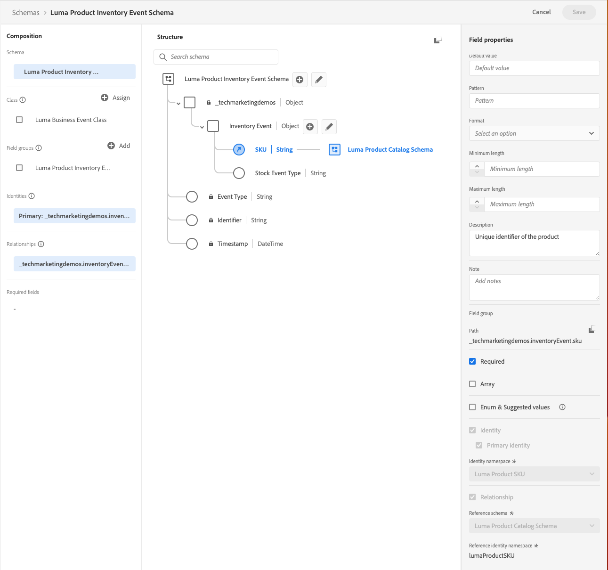

# Configuración manual de datos

En esta sección, se crean las áreas de nombres de identidad necesarias y se define la [!DNL Luma] estructura de datos de muestra creando los [[!UICONTROL esquemas]](https://experienceleague.adobe.com/docs/experience-platform/xdm/schema/composition.html?lang=es).

>[!TIP]
>Vea el videotutorial [Asignación de identidades](/help/set-up-data/map-identities.md) antes de empezar.

## Paso 1: Crear áreas de nombres de identidad

En este paso, creará áreas de nombres de identidad para [!DNL Luma] campos de identidad personalizados con nombre `lumaLoyaltyId`, `lumaCrmId` y `lumaProductSKU`. Las áreas de nombres de identidad desempeñan un papel esencial en la creación de perfiles de clientes en tiempo real, ya que dos valores coincidentes en la misma área de nombres permiten que dos fuentes de datos formen un gráfico de identidad.

Comience creando un [!UICONTROL area de nombres] para el [!DNL Luma Loyalty ID] esquema:

1. En la interfaz de usuario de Journey Optimizer, vaya a **[!UICONTROL Cliente]** > **[!UICONTROL Identidades]** en el panel de navegación izquierdo.

1. Seleccione **[!UICONTROL Crear área de nombres de identidad]**.

1. Proporcione los siguientes detalles:

   | Nombre para mostrar | Símbolo de identidad | Tipo |
   |---|---|---|
   | `Luma Loyalty ID` | `lumaLoyaltyId` | [!UICONTROL ID entre dispositivos] |

1. Seleccione **[!UICONTROL Crear]**.

   

1. Cree dos áreas de nombres más siguiendo los mismos pasos:

   | Nombre para mostrar | Símbolo de identidad | Tipo |
   |---|---|---|
   | `Luma CRM ID` | `lumaCrmId` | [!UICONTROL ID entre dispositivos] |
   | `Luma Product SKU` | `lumaProductSKU` | [!UICONTROL Identificador de no personas] |

## Paso 2: Crear esquemas

En este paso, defina la estructura de los datos de muestra creando seis [[!UICONTROL esquemas]](https://experienceleague.adobe.com/docs/experience-platform/xdm/schema/composition.html?lang=es):

* [[!DNL Luma Loyalty Schema]](#create-luma-loyalty-schema)

* [[!DNL Luma Product Catalog Schema]](#create-luma-product-catalog-schema)

* [[!DNL Luma Product Inventory Events] Esquema](#create-luma-product-inventory-event-schema)

* [[!DNL Luma CRM Schema]](#create-luma-crm-and-luma-product-interactions-schemas)

* [[!DNL Luma Web Events Schema]](#create-luma-crm-and-luma-product-interactions-schemas)

* [[!DNL Luma Offline Purchase Events Schema]](#create-additional-schemas)

* [[!DNL Luma Test Profiles Schema]](#create-additional-schemas)

>[!TIP]
>
>Vea el videotutorial: [Creación de un esquema](/help/set-up-data/create-schema.md) antes de empezar.

### Crear [!DNL Luma Loyalty Schema] {#create-luma-loyalty-schema}

En esta sección se describe cómo crear el [!DNL Luma Loyalty] esquema y cómo configurar los grupos de campos.

#### Creación del esquema

1. Vaya a **[!UICONTROL ADMINISTRACIÓN DE DATOS]** > **[!UICONTROL Esquemas]** en el panel de navegación izquierdo.

1. Seleccione **[!UICONTROL Crear esquema]** en la parte superior derecha.

1. En el menú desplegable, seleccione **[!UICONTROL Perfil individual de XDM]**.

   Seleccione esta opción porque está modelando atributos de un cliente individual (puntos, estado, etc.).

#### Adición de grupos de campos existentes

A continuación, se le pedirá que añada grupos de campos al esquema mediante grupos. Debe agregar grupos de campos existentes y crear un grupo de campos.

1. En la página del [!UICONTROL Esquema], si el modal Grupos de campos no se ha abierto automáticamente, seleccione **[!UICONTROL Añadir]**.

   

1. En la página de **[!UICONTROL Agregar grupos de campos]**, habilite los siguientes grupos de campos:

   * **[!UICONTROL Datos demográficos]** para datos básicos del cliente, como el nombre y la fecha de nacimiento.

   * **[!UICONTROL Datos personales de contacto]** para obtener información básica de contacto, como la dirección de correo electrónico y el número de teléfono.

   * **[!UICONTROL Detalles de fidelidad]** para obtener detalles de fidelidad, como puntos, fecha de unión o estado. El grupo de campos de fidelidad está muy por debajo de la lista, por lo que es más fácil buscarlo.

1. Seleccionar **[!UICONTROL Agregar grupo de campos]** para agregar los tres grupos de campos al esquema.

   

1. Seleccione el nodo superior del esquema.

1. Escriba `Luma Loyalty Schema` como **[!UICONTROL Nombre para mostrar]**.

#### Crear un [!UICONTROL grupo de campo] {#create-field-group}

Para garantizar la coherencia en todos los esquemas, Adobe recomienda administrar todos los identificadores del sistema en un solo grupo:

1. Desde la sección de **[!UICONTROL Composición]** debajo de [!UICONTROL Grupos de campo], seleccione **[!UICONTROL Añadir]**.

1. Seleccione **[!UICONTROL Crear nuevo grupo de campo]**.

1. Añada `Luma Identity Profile Field Group` como **[!UICONTROL Nombre para mostrar]**.

1. Añada `system identifiers for XDM Individual Profile class` como **[!UICONTROL Descripción]**.

1. Seleccione **[!UICONTROL Agregar grupos de campos]**.

   

#### Añada campos al nuevo [!UICONTROL grupo de campo] 

El nuevo grupo de campo vacío se agrega al esquema. Con los botones +, puede agregar nuevos campos a cualquier ubicación de la jerarquía. En este caso, debe añadir campos en el nivel raíz:

1. Seleccione **[!UICONTROL +]** junto al nombre del esquema.

   Este paso añade un campo debajo del área de nombres de **su id de inquilino**, para administrar los conflictos entre los campos personalizados y los campos estándar.

1. En la barra lateral **[!UICONTROL Propiedades del campo]**, añada los detalles del nuevo campo:

   * **Nombre del campo:** `systemIdentifier`

   * **[!UICONTROL Nombre para mostrar]:** `System Identifier`

   * **Tipo:** objeto

   * **[!UICONTROL Asignar grupo de campos]:** [!DNL Luma identifiers]

1. Seleccione **[!UICONTROL Aplicar]**.

   

   Añada dos campos debajo del `systemIdentifier` objeto:

   | [!UICONTROL Nombre del campo] | [!UICONTROL Nombre para mostrar] | [!UICONTROL Tipo] |
   |-------------|-----------|----------|
   | `loyaltyId` | `Loyalty Id` | [!UICONTROL Cadena] |
   | `crmId` | `CRM Id` | [!UICONTROL Cadena] |

#### Establecer identidades

Ahora tiene el [!UICONTROL área de nombres] y el [!DNL Luma Loyalty schema] configurado. Para poder introducir datos, debe etiquetar los campos de identidad. Cada esquema utilizado con [!UICONTROL Perfil del cliente en tiempo real] es necesario para tener una identidad principal especificada y cada registro introducido debe tener un valor para ese campo.

1. Configure la **identidad principal**:

   Desde el **[!DNL Luma Loyalty Schema]**:

   1. Seleccione el **[!DNL Luma Identity Profile Field Group]**.

   2. Seleccione el campo **[!DNL loyaltyId]**.

   3. En **[!UICONTROL Propiedades del campo]**, habilite el cuadro de **[!UICONTROL Identidad]**.

   4. Habilite el cuadro de **[!UICONTROL Identidad principal]**.

   5. Seleccione el `Luma Loyalty Id`área de nombres del menú desplegable de **[!UICONTROL Áreas de nombres de identidad]**.

   6. Seleccione **[!UICONTROL Aplicar]**.

      

2. Establezca una **identidad secundaria**:

   Desde el **[!DNL Luma Loyalty Schema]**:

   1. Seleccione el **[!DNL Luma Identity Profile Field Group]**.

   2. Seleccione el campo `crmId`.

   3. En **[!UICONTROL Propiedades del campo]**, habilite el cuadro de **[!UICONTROL Identidad]**.

   4. Seleccione el `Luma CRM Id` área de nombres del menú desplegable de **[!UICONTROL Áreas de nombres de identidad]**.

   5. Seleccione **[!UICONTROL Aplicar]**.

#### Habilítelo para el perfil y guarde el esquema

1. Seleccione el nodo superior del esquema.

1. En [!UICONTROL Propiedades del campo], habilite **[!UICONTROL Perfil]**.

   El esquema debería tener este aspecto:

   

1. Seleccione **[!UICONTROL Guardar]**.

### Crear [!DNL Luma Product Catalog Schema] {#create-luma-product-catalog-schema}

1. Vaya a **[!UICONTROL ADMINISTRACIÓN DE DATOS]** > **[!UICONTROL Esquemas]** en el panel de navegación izquierdo.

1. Seleccione **[!UICONTROL Crear esquema]** (parte superior derecha).

1. Para crear una clase, seleccione **[!UICONTROL Examinar todos los tipos de esquemas]** en el menú desplegable.

1. Seleccione **[!UICONTROL Crear nueva clase]**.

1. Añada el nombre para mostrar: `Luma Product Catalog Class`.

1. Asignar clase.

1. Cree un [!UICONTROL Grupo de campos]:

   * Nombre para mostrar: `Luma Product Catalog Field Group`

1. Añada el siguiente campo a **[!DNL Luma Product Catalog Field Group]**.

   * Nombre del campo: `product`

   * Nombre para mostrar: `Product`

   * Tipo: [!UICONTROL objeto]

   * Grupo de campos: [!DNL Luma Product Catalog Field Group]

1. Seleccione **[!UICONTROL Aplicar]**.

1. Añada los campos siguientes al objeto **[!DNL Product]**:

   | [!UICONTROL Nombre del campo] | [!UICONTROL Nombre para mostrar] | [!UICONTROL Tipo] |
   |-------------|-----------|----------|
   | `sku` | `Product SKU` | [!UICONTROL Cadena] |
   | `name` | `Product Name` | [!UICONTROL Cadena] |
   | `category` | `Product Category` | [!UICONTROL Cadena] |
   | `color` | `Product Color` | [!UICONTROL Cadena] |
   | `size` | `Product Size` | [!UICONTROL Cadena] |
   | `price` | `Product Price` | [!UICONTROL Doble] |
   | `description` | `Product Description` | [!UICONTROL Cadena] |
   | `imageUrl` | `Product Image URL` | [!UICONTROL Cadena] |
   | `stockQuantity` | `Product Stock Quantity` | [!UICONTROL Cadena] |
   | `url` | `Product URL` | [!UICONTROL Cadena] |

1. Configure las variables **[!DNL SKU]** como identidad principal.
1. Añada el **[!UICONTROL Nombre para mostrar]** `Luma Product Catalog Field Group` al [!UICONTROL grupo de campos].

1. Seleccione **[!UICONTROL Guardar]**.

### Crear [!DNL Luma Product Inventory Event Schema] {#create-luma-product-inventory-event-schema}

1. Vaya a **[!UICONTROL ADMINISTRACIÓN DE DATOS]** > **[!UICONTROL Esquemas]** en el panel de navegación izquierdo.

1. Seleccione el botón de **[!UICONTROL Crear esquema]** en la parte superior derecha.

1. En el menú desplegable, seleccione **[!UICONTROL Examinar todos los tipos de esquemas]**.

1. Seleccione **[!UICONTROL Crear nueva clase]**.

1. Añada el nombre para mostrar: `Luma Business Event Class`.

1. Seleccione el tipo: *[!UICONTROL Serie temporal]*.

1. Asignar clase.

1. Cree un [!UICONTROL grupo de campos]:

   * Nombre para mostrar: `Luma Product Inventory Event Details Field Group`

1. Añada el **[!UICONTROL Nombre para mostrar]** `Luma Product Inventory Event Schema` al esquema.

1. Añada el siguiente campo a **[!DNL Luma Product Inventory Event Details Field Group]**:

   * Nombre del campo: `inventoryEvent`

   * Nombre para mostrar: `Inventory Event`

   * Tipo: [!UICONTROL objeto]

   * Grupo de campos: `Luma Product Inventory Event Details Field Group`

1. Añada los campos siguientes al objeto `Product Inventory Event Details`:

   | [!UICONTROL Nombre del campo] | [!UICONTROL Nombre para mostrar] | [!UICONTROL Tipo] |
   |-------------|-----------|----------|
   | `sku` | `SKU` | [!UICONTROL Cadena] |
   | `stockEventType` | `Stock Event Type` | [!UICONTROL Cadena] |

   1. para establecer la variable `stockEventType` para Enumerar, seleccione el tipo: `string`.

   2. Desplácese hacia abajo hasta la parte inferior de **[!UICONTROL Propiedades del campo]**.

   3. Active **[!UICONTROL Enumeración]**.

   4. Introduzca **[!UICONTROL valores] ([!UICONTROL etiqueta)]**: `restock` (`Restock`).

   5. Seleccione **[!UICONTROL Añadir fila]**.

   6. Introduzca **[!UICONTROL valores] ([!UICONTROL etiqueta)]**: `outOfStock` (`Out of Stock`).

   7. Seleccione **[!UICONTROL Aplicar]**.

      

1. Establezca `inventory.Event.sku` campo como **[!UICONTROL identidad principal]** usando **[!DNL LumaProductSKU namespace]**.

1. Seleccione el `sku` campo y defina una relación con el `product.sku` campo en el **[!DNL Luma Product catalog Schema]** Esquema:

   1. Desplácese hacia abajo hasta la parte inferior de **[!UICONTROL Propiedades del campo]**.

   2. Active **[!UICONTROL Relación]**.

      1. **[!UICONTROL Esquema de referencia]**: [!DNL Luma Product Catalog Schema].

      2. **[!UICONTROL Referencia al Área de nombres de identidad]**: [!DNL LumaProductSKU].
   3. Seleccione **[!UICONTROL Aplicar]**.

      El esquema debería tener este aspecto:

      

1. Habilitar para **Perfil**.

1. Seleccione [!UICONTROL Guardar] para guardar el esquema.

### Creación de esquemas adicionales {#create-additional-schemas}

Cree los siguientes [!UICONTROL esquemas] adicionales:

| [!UICONTROL Nombre para mostrar] | [!DNL Luma CRM Schema] | [!DNL Luma Web Events Schema] | [!DNL Luma Test Profiles schema] | [!DNL Luma Offline Purchase Events Schema] |
|  ---| ------- | ---- |----|----|
| **[!UICONTROL Clase]** | [!UICONTROL Perfil individual de XDM] | [!UICONTROL Evento de experiencia de XDM] | [!UICONTROL Perfil individual de XDM] | [IUICONTROL XDM ExperienceEvent] |
| **[!UICONTROL Añadir grupo de campos existente]** | `Luma Identity Profile Field Group` `Demographic Details` `Personal Contact Details` | `Orchestration eventID` `Consumer Experience Event` `AEP Web SDK ExperienceEvent` | `Luma Identity Profile Field Group` `Demographic Details` `Personal Contact Details` `Profile test details` | `Luma Identity Profile Field Group`  `Commerce Details` |
| **[!UICONTROL Relación]** |  | `productListItems.SKU`:  Esquema de referencia `Luma Product Catalog Schema`  [!DNL Reference identity namespace] `lumaProductSKU` |  | `productListItems.SKU`:  Esquema de referencia `Luma Product Catalog Schema`  [!DNL Reference identity namespace] `lumaProductSKU` |
|  [!UICONTROL Área de nombres])**de la**[!UICONTROL  Identidad principal] | `systemIdentifier.crmId` |  | `systemIdentifier.crmId` | `systemIdentifier.LoyaltyId` |
| **[!UICONTROL Habilitar esquema para perfil]** | sí | sí | sí | sí |

## Pasos siguientes

Ahora que ha generado la estructura de datos, puede [crear conjuntos de datos e introducir datos de muestra](/help/tutorial-configure-a-training-sandbox/manual-data-ingestion.md).
