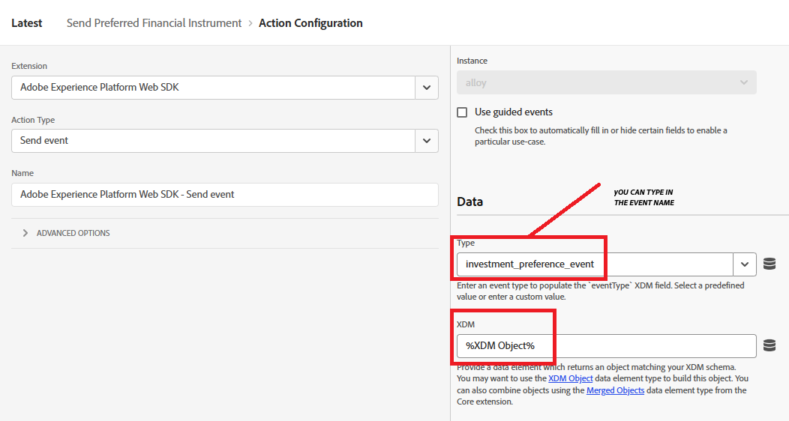

# Creación de etiquetas de Adobe Experience Platform

Las etiquetas de Adobe Experience Platform (anteriormente Adobe Launch) ayudan a administrar e implementar* tecnologías de marketing y análisis en su sitio web sin necesidad de cambiar el código del sitio.

En este [vídeo se describe el proceso de creación de Adobe Experience Tags](https://experienceleague.adobe.com/es/playlists/experience-platform-get-started-with-tags)

* Iniciar sesión en la recopilación de datos
* Haga clic en Etiquetas -> Nueva propiedad
* Cree una etiqueta de Adobe Experience Platform llamada Asesores financieros.

* Añada las siguientes extensiones a la etiqueta
  

* Asegúrese de configurar Adobe Experience Platform Web SDK para que utilice el entorno correcto y el DataStream de Financial Advisors creado en el paso anterior.
  

* No se necesita ninguna configuración adicional para las extensiones principales y de capa de datos del cliente de Adobe

## Crear elementos de datos

Los elementos de datos se utilizan para recopilar, organizar y entregar datos a través de la tecnología de publicidad y marketing basada en web.

Cree los siguientes elementos de datos

| Nombre de elemento | Extensión | Tipo de elemento de datos | Comentarios adicionales |
|------------------------------|-----------------------------------|-------------------|------------------------------------------------------------------------------------------------------------------------------------------------------------------|
| PreferredFinancialInstrument | Núcleo | Código personalizado | Consulte la nota siguiente |
| Objeto XDM | SDK web de Adobe Experience Platform | Objeto XDM | Seleccione su entorno y el esquema de los asesores financieros |


Para el código personalizado, abra el editor de código, y copie y pegue el siguiente código

```javascript
return window.adobeDataLayer
  ?.slice()
  .reverse()
  .find(event => event.event === "assetClassSelection")
  ?.xdm?.FinancialInterest?.PreferredFinancialInstrument || "undefined";
```

## Explicación del código

Observe la matriz adobeDataLayer (que almacena los eventos que se producen en la página web).

Realice una copia de la matriz utilizando.slice() para que no se cambie el original.

Invierta el orden de los eventos para comprobar primero los más recientes.

Busque el primer evento (a partir del más reciente) en el que event.event sea exactamente &quot;assetClassSelection&quot;.

Si se encuentran, vaya a los datos xdm de ese evento y obtenga el valor de FinancialInterest.PreferredFinancialInstrument.

Si no se encuentra nada, devuelva la cadena &quot;undefined&quot;,


## Crear regla

El Generador de reglas de Etiquetas de Adobe Experience Platform le permite definir cuándo y cómo deben ejecutarse las acciones específicas en el sitio web en función del comportamiento o los eventos del usuario.

* Cree una regla denominada Enviar instrumento financiero preferido. Esta regla contiene un evento y una acción


* Cree una configuración de evento denominada Clase de recurso preferido seleccionada como se muestra a continuación. Este evento escucha eventos assetClassSelection.
  


* Cree una acción para enviar el esquema XDM actualizado a AEP
  

* La regla final debería ser la siguiente
  

## Creación e implementación de etiquetas de AEP


Cree una nueva biblioteca y añádale todos los recursos modificados, como se muestra en las capturas de pantalla siguientes.

Añadir biblioteca


Crear una biblioteca.

En la pantalla Crear biblioteca, especifique el nombre de la biblioteca y el entorno.
Debe añadir todos los recursos modificados a esta biblioteca


A continuación, haga clic en el botón Guardar y crear en desarrollo para crear la biblioteca

## Incluir etiquetas de AEP en la página de HTML

Cuando publica una propiedad de etiquetas de AEP, Adobe le proporciona una etiqueta de script que debe colocar dentro de su HTML ``` <head>``` o en la parte inferior de las etiquetas ``` <body>```.

* Vaya a su propiedad de Tags (asesores financieros).

* Haga clic en Entornos y en el icono de instalación del entorno que desee (por ejemplo, Desarrollo, Ensayo, Producción).

* Anote el código incrustado. Se necesita en una etapa posterior de este tutorial.
