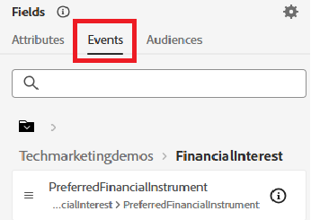

# Creación de audiencias en Adobe Journey Optimizer

Las audiencias en Adobe Experience Platform son grupos de usuarios creados en función de sus acciones, preferencias o información de perfil para ofrecer experiencias personalizadas.

* Iniciar sesión en Journey Optimizer
* Vaya a Cliente -> Audiencias -> Crear audiencia
* Crear audiencias mediante el método de generación de reglas

  

* Crear las tres audiencias siguientes

   * Clientes interesados en las acciones

   * Clientes interesados en bonos

   * Clientes interesados en el CD

* Asegúrese de que el método de evaluación de cada audiencia esté establecido en _**Edge**_ para la calificación en tiempo real.
  

* Utilice el campo PreferredFinancialInstrument para segmentar a los usuarios según su interés de inversión seleccionado, como acciones, bonos o CD

>[!NOTE]
>
>>Si el campo PreferredFinancialInstrument no está visible en la pestaña Eventos, haga clic en el icono de configuración y active Mostrar el esquema XDM completo.

