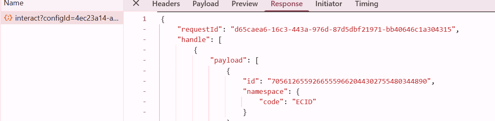

# Prueba de la solución

Para validar la implementación de, abra la página web que contiene el formulario de preferencias. Utilice las herramientas de desarrollo del explorador (pestañas Consola y Red) para monitorizar el proceso de envío del formulario. Después de enviar una preferencia (por ejemplo, seleccionando &quot;Existencias&quot;), confirme que AEP Web SDK (alloy.sendEvent) realiza correctamente el déclencheur y que se envían los datos correctos a Adobe Experience Platform. En AEP, vaya a la sección Audiencias y compruebe que su perfil cumple los requisitos de la audiencia esperada (por ejemplo, &quot;Interesado en acciones&quot;) en unos momentos, mediante la segmentación de Edge. También puede inspeccionar los datos de evento entrantes en el conjunto de datos asociado para asegurarse de que contienen el valor de preferencia correcto. Repetir este proceso para cada clase de recurso (acciones, bonos, CD) para garantizar que el flujo de trabajo completo funcione correctamente.

## Sugerencias de resolución de problemas

Si no ve que el perfil cumple los requisitos para la audiencia deseada inmediatamente, compruebe lo siguiente:

### Validar inserción de capa de datos de Adobe

* Abra la consola de → Herramientas para desarrolladores del explorador
* Escriba console.log(window.adobeDataLayer);
* Confirme que aparece un evento con el evento: &quot;assetClassSelection&quot; y el valor correcto de PreferredFinancialInstrument después del envío del formulario

### Confirmar ejecución de regla de Launch

* Abra Adobe Experience Platform Debugger (extensión de Chrome)
* Inicio de sesión en Debugger
* Enviar el formulario
* Compruebe que se captura el evento DataPushing para assetClassSelection

La siguiente captura de pantalla del depurador debería ayudarle

### Obtención del ECID

El ECID (Experience Cloud ID) es el identificador único y persistente de Adobe que se utiliza para reconocer y unificar a los usuarios en todas las soluciones y sesiones de Experience Cloud.

* Pestaña Herramientas para desarrolladores de Chrome → Red

* Filtrar por &quot;interactuar&quot; o &quot;recopilar&quot;

* Enviar el formulario
* Haga clic en la pestaña Respuesta y anote el ECID

### Comprobación del perfil en tiempo real y la calificación de audiencias

* Iniciar sesión en Journey Optimizer
* Vaya a Clientes->Perfiles->Examinar.
* Busque el ECID que obtuvo en el paso anterior, como se muestra en la captura de pantalla
  
* Haga clic en el perfil y seleccione la pestaña de eventos para comprobar si investment_preferences_event aparece en la lista
  
* Abra el json asociado al evento y compruebe si contiene los datos de evento correctos.

### Sugerencias adicionales de solución de problemas

* Asegúrese de que el esquema y el perfil del conjunto de datos estén habilitados.
* Asegúrese de que la segmentación de Edge esté habilitada para la audiencia de modo que la calificación se produzca en tiempo casi real.
* Esperar unos minutos y actualizar la vista Audiencias también puede ser útil, especialmente si realiza pruebas justo después de publicar los cambios.
* Asegúrese de que las reglas de audiencia estén definidas correctamente y hagan referencia a los nombres de campo y valores exactos capturados desde el envío del formulario.
