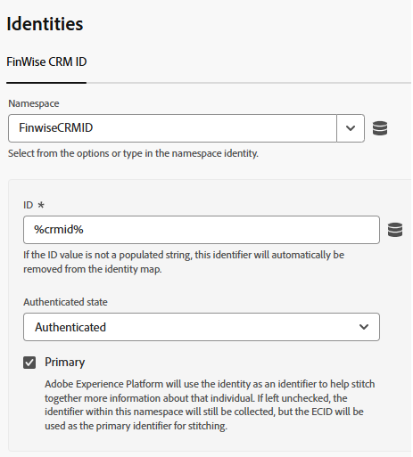
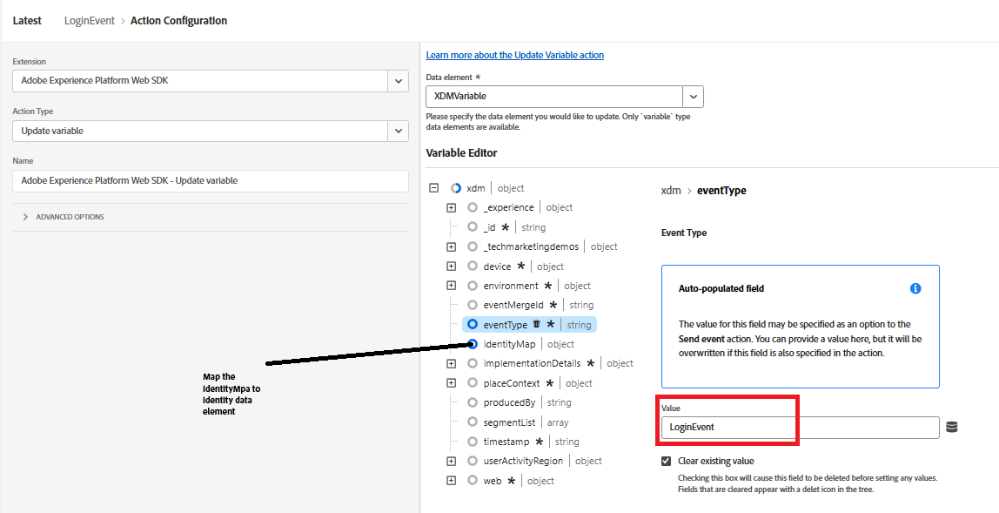

# Envío de CRMID a Adobe Experience Platform

Las etiquetas de Adobe Experience Platform se utilizan para enviar el CRMID a Adobe Experience Platform (AEP), ya que ofrece un mecanismo flexible basado en eventos para transmitir datos de identidad directamente desde el explorador. El envío de CRMID después del inicio de sesión del usuario permite a AEP vincular el ECID anónimo con el perfil de CRM conocido, lo que permite vincular con precisión la identidad. Este vínculo forma la base para crear perfiles unificados de clientes, calificar audiencias y ofrecer experiencias personalizadas en tiempo real en Adobe Journey Optimizer (AJO).

Se crea una propiedad de etiquetas de Experience Platform llamada _&#x200B;**FinWise**&#x200B;_. Se han añadido las siguientes extensiones a la propiedad Etiquetas

Configure la extensión AEP Web SDK mediante el flujo de datos de Financial Advisors creado en el paso anterior.
El servicio de Experience Cloud ID es una extensión opcional añadida a la propiedad de etiquetas con fines de depuración.

## Elementos de datos de etiquetas

Cree los siguientes elementos de datos

| Elemento de datos | Extensión | Tipo de elemento de datos | Configuración personalizada |
|--------------|-----------------------------------|---------------------------|----------------------------------------|
| crmid | Capa de datos del cliente de Adobe | Estado calculado de la capa de datos | user.crmid |
| ECID | Servicio de Experience Cloud ID | ECID |                                        |
| identidad | SDK web de Adobe Experience Platform | Mapa de identidad |  |
| XDMVariable | SDK web de Adobe Experience Platform | Variable |  |

## Crear regla

Cree una regla denominada LoginEvent con los eventos y las acciones siguientes

Evento

Acción de actualizar variable

Acción Enviar evento

## Guardar y crear

Guarde los cambios, cree y cree la biblioteca.
