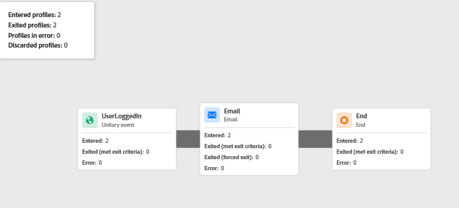

# Prueba de la vinculación de identidad

Esta aplicación de ejemplo simula un flujo de inicio de sesión en el mundo real en el que las credenciales de usuario se validan en el servidor antes de que el ID de CRM se envíe a Adobe Experience Platform (AEP). Un servidor Node.js local se utiliza para servir de forma segura las páginas web, gestionar la lógica de autenticación básica y evitar restricciones del explorador (como el acceso bloqueado a archivos locales o la falta de encabezados CORS) que podrían interferir con la funcionalidad de Adobe Launch o Web SDK. Esta configuración garantiza que la experiencia esté más cerca de un entorno de producción real.

## Instalación de node.js

Si no tiene Node.js instalado, descargue e [instálelo desde aquí](https://nodejs.org/)

Compruebe la instalación ejecutando:

`node -v`

`npm -v`

## Configurar la carpeta del proyecto

Cree un nuevo directorio para la aplicación de ejemplo con los siguientes comandos

`mkdir aep-demo`

`cd aep-demo`

## Inicializar el proyecto

`npm init -y`

## Instalar Express (Web Server Framework)

`npm install express`

## Crear archivo server.js

```javascript
const express = require('express');
const path = require('path');
const app = express();
const PORT = 3000;

// Serve static files from the current directory
app.use(express.static(__dirname));

app.listen(PORT, () => {
  console.log(`Server is running at http://localhost:${PORT}`);
});
```

## Añadir HTML/Assets

Copie todos los [archivos HTML y CSS](assets/login-app-files.zip) proporcionados en esta carpeta. Copie y pegue el script de etiquetas de AEP dentro de la sección `<head>` del archivo index.html.

## Ejecutar el servidor

`node server.js`

## Prueba

Abra la URL `http://localhost:3000`. El inicio de sesión utiliza alice/pass123

## Uso de AEP Debugger

Adobe Experience Platform Debugger es una potente extensión del explorador que ayuda a validar los datos que se envían desde el sitio web a Adobe Experience Platform. Resulta especialmente útil para comprobar si el identityMap se configura y transmite correctamente a través de Adobe Web SDK (alloy.js).

Utilice AEP Debugger para probar eventos de inicio de sesión, verificar la vinculación de identidad (por ejemplo, si se pasan ECID y CRMID) y garantizar que las reglas de etiquetas de AEP y los elementos de datos se activan según lo esperado. Proporciona visibilidad en tiempo real de eventos salientes, información de identidad y cargas XDM, esenciales para solucionar problemas de enriquecimiento de perfiles y calificación de audiencias.

La captura de pantalla siguiente muestra el ID &quot;FIN001&quot; transferido correctamente.


## Pasos para verificar la configuración de identidad en AEP

* Inicie sesión en AEP
* Vaya a Cliente -> Perfiles -> Examinar
* Buscar ID de FinWise CRM = FIN001
* Abra el perfil y observe la sección Identidades. Debe ver tanto el CRMID como el ECID en la lista.   Esto confirma que las dos identidades se vincularon en un solo perfil.
* El recorrido también debe activarse. Para comprobarlo, consulte el informe de recorrido
* 


