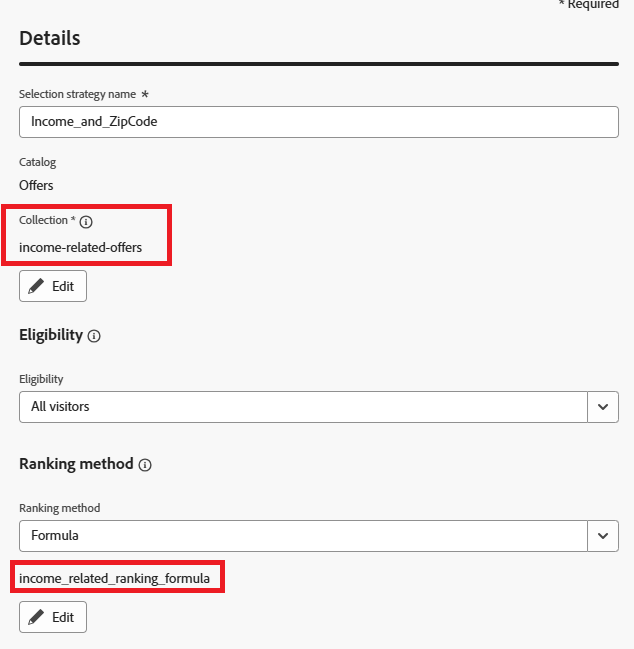

# Crear una estrategia de selección

Una estrategia de selección es una configuración reutilizable que combina una colección de ofertas con reglas de idoneidad y un método de clasificación para determinar qué ofertas se muestran cuando la estrategia se utiliza en una política de decisión.

Para crear una estrategia de selección

* Iniciar sesión en Journey Optimizer

* Vaya a Decisioning ->Strategy setup ->Selection strategy ->Create selection strategy

* Proporcione el nombre de la estrategia de selección, la colección, la idoneidad y el método de clasificación, como se muestra en la captura de pantalla

Asegúrese de utilizar la fórmula como método de clasificación

