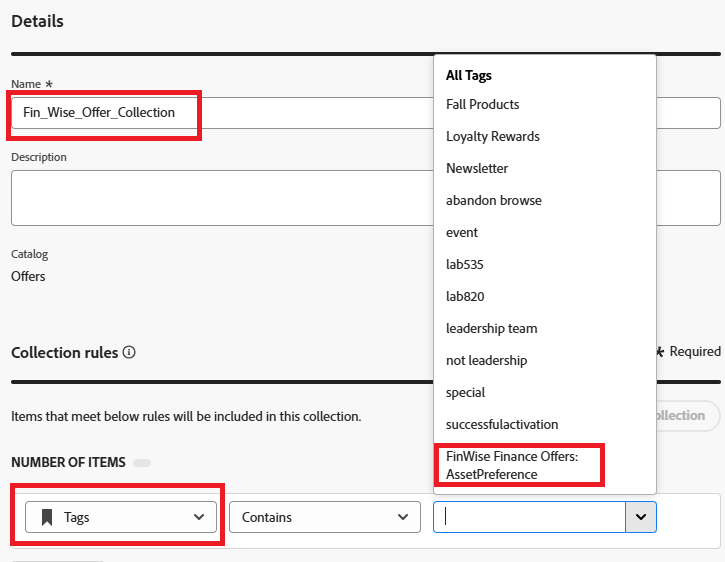

# Crear colección

Las colecciones le permiten categorizar y agrupar los elementos de decisión según sus preferencias. Estas categorías se crean creando reglas que aprovechan los atributos de los elementos de decisión.

* Inicie sesión en Journey Optimizer
* Decisioning -> Catalogs -> Collections ->Create collection
* Especifique el nombre de la colección y las reglas de la colección como se muestra en la captura de pantalla

